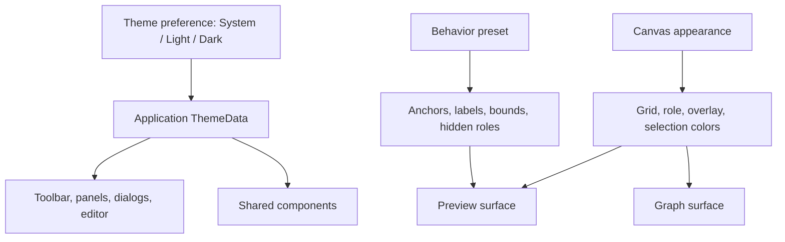
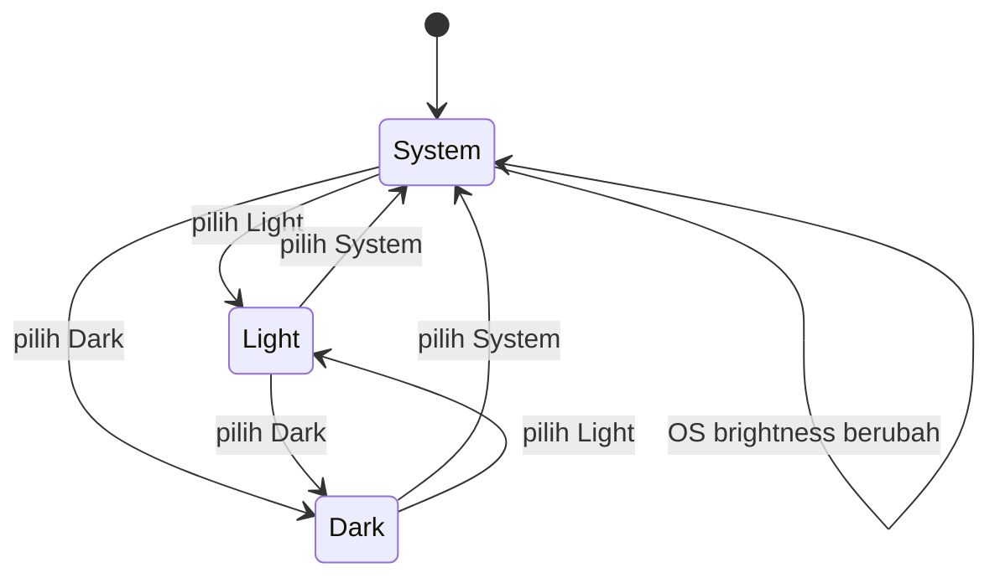

# Sub-Rencana 01 — Modular Workbench dan Theme System

**Status:** Tahap A selesai; Tahap B selesai sebagian; Tahap C berjalan sebagian; Tahap D berjalan sebagian; Tahap E berjalan sebagian  
**Repository pemilik:** `relgeo/flutter`  
**Pemilik keputusan:** Agus Made  
**Compatibility line:** RelGeo DSL 0.5.x  
**Target utama:** macOS, Ubuntu/Linux, dan Windows 11

> **Status snapshot — 2026-09-27:** Shell presentasional (navbar, toolbar, overlay, viewport panel), feature surface preview/editor/inspector, controller viewport, controller overlay, boundary hasil kompilasi dokumen, boundary editor, document settings parser, composition shell, orchestration persistence aplikasi/workbench, boundary ekspor SVG native, kontrak ukuran/window host, dan fallback compact layout sudah dipisahkan/didefinisikan. Gate kode yang sudah memiliki evidence: `flutter analyze` lulus, `flutter test` lulus (**174 test**), golden light/dark lulus, `flutter build web --debug --no-wasm-dry-run` lulus, `flutter build macos --debug` lulus menghasilkan `.app`, dan smoke test `flutter run -d macos --debug` berhasil tanpa overflow warning setelah toolbar overlay dibuat responsif. Verifikasi ulang untuk perubahan window host terbaru belum dapat ditutup karena terminal VSCode remote timeout. Implementasi native per host, Linux/Windows, packaging, serta validasi runtime aksesibilitas masih terbuka.

## 1. Tujuan

Mematangkan Flutter Workbench sebagai aplikasi desktop yang:

- memiliki pembagian widget, feature, state, dan platform boundary yang jelas;
- mendukung light mode dan dark mode secara konsisten;
- memakai **System** sebagai default dan mengikuti perubahan theme OS;
- tetap membedakan theme UI aplikasi dari appearance canvas teknis;
- dapat dikembangkan tanpa membuat `CADWorkbenchPage` menjadi pusat semua tanggung jawab.

Rencana ini berfokus pada fondasi arsitektur dan visual. Ini bukan rencana untuk menambah capability DSL baru atau mengejar parity SVG yang belum memiliki keputusan kontrak.

## 2. Temuan baseline

Baseline saat ini sudah memiliki beberapa pemisahan yang berguna:

- `editor_panel.dart` untuk editor dan autocomplete;
- `inspector_panel.dart` untuk inspection;
- `canvas_painter.dart` dan painter terkait untuk rendering;
- `workbench_preferences.dart` untuk persistence preference;
- `workbench_visual_profile.dart` untuk warna dan behavior preset.

Tahap A telah menutup dua temuan awal: `main.dart` sekarang memasok
`theme`, `darkTheme`, dan `themeMode`, sedangkan preference baru memakai
`system` sebagai default. Sisa boundary yang masih perlu diperjelas:

- `WorkbenchVisualProfile` masih menjadi composition object untuk Material theme, `canvasAppearance`, dan `behavior`, sehingga builder Material masih perlu dipisahkan lebih lanjut;
- `CADWorkbenchPage` masih memegang state editor, preview, file operation, inspector, preference, dan layout sekaligus;
- sebagian komponen UI dan painter masih dapat bergantung langsung pada warna tertentu.

## 3. Keputusan arsitektur

### 3.1 Tiga lapisan visual

Theme system harus memisahkan tiga konsep berikut:

1. **Application theme** — light/dark untuk toolbar, panel, dialog, menu, editor, inspector, dan komponen Material.
2. **Canvas appearance** — background viewport, grid, role colors, selection, overlay, dan warna geometry.
3. **Behavior preset** — anchor, label, bounding box, hidden roles, serta grid step.

`WorkbenchVisualProfile` tidak lagi menjadi pemilik ketiganya sekaligus. Jika nama tersebut tetap dipertahankan untuk kompatibilitas internal, tanggung jawabnya harus dipersempit atau dipecah menjadi model yang lebih spesifik.



### 3.2 ThemeMode

Gunakan kontrak Flutter standar:

```dart
MaterialApp(
  theme: buildRelGeoLightTheme(),
  darkTheme: buildRelGeoDarkTheme(),
  themeMode: selectedThemeMode,
)
```

Nilai preference yang disimpan:

- `system` — default;
- `light`;
- `dark`.

Yang disimpan adalah pilihan pengguna, bukan mode hasil resolusi. Dengan begitu `system` tetap dapat mengikuti perubahan mode OS saat aplikasi berjalan.

### 3.3 ThemeExtension

Warna khas RelGeo yang tidak tersedia di `ColorScheme` harus memakai `ThemeExtension`, misalnya:

- canvas background;
- minor/major grid;
- final geometry;
- construction geometry;
- centerline;
- dimension;
- annotation;
- selected object;
- diagnostic/error overlay.

Painter dan feature UI membaca token melalui `BuildContext`, bukan mengimpor profil warna global atau memakai warna hardcoded.

### 3.4 Canvas profile tetap boleh ada

`Blueprint`, `Paper`, atau preset sejenis tetap dapat dipertahankan sebagai **canvas appearance**. Namun preset tersebut tidak boleh memaksa seluruh aplikasi menjadi light/dark secara diam-diam.

Contoh kombinasi yang valid:

- application dark + canvas blueprint;
- application light + canvas paper;
- application dark + canvas paper untuk kebutuhan kontras tertentu.

Jika kombinasi ini terlalu kompleks pada tahap awal, implementasi pertama cukup menyediakan light/dark application theme dan satu canvas appearance yang mengikuti mode aplikasi. Preset tambahan ditunda sampai boundary dasarnya stabil.

## 4. Struktur modul target

Struktur ini adalah arah modularisasi, bukan kewajiban memindahkan semua file sekaligus:

```text
lib/src/
  app/
    relgeo_app.dart
    app_theme.dart
    app_preferences.dart
    app_shell.dart

  features/
    editor/
    preview/
    inspector/
    graph/
    files/
    settings/

  shared/
    widgets/
    controls/
    layout/
    theme/

  platform/
    window/
    file_system/
```

Aturan boundary:

- feature tidak mengimpor state internal feature lain secara langsung;
- komponen shared tidak mengetahui detail `ResolvedScene` kecuali memang merupakan adapter yang jelas;
- theme token berada di shared/theme;
- akses file dan window platform berada di platform boundary;
- `app/` merakit dependency dan navigation, bukan menampung seluruh logic feature;
- `CADWorkbenchPage` secara bertahap menjadi shell/composition root.

## 5. Window dan layout desktop

Window concerns perlu dipisahkan dari feature widget:

- minimum window size;
- title dan application shell;
- resize behavior;
- desktop keyboard shortcuts;
- menu/command surface;
- perbedaan capability macOS, Linux, dan Windows.

Widget feature tidak boleh memiliki branching platform yang menyebar. Gunakan abstraction seperti `DesktopWindowHost` atau service kecil yang memiliki implementasi platform bila memang diperlukan.

Layout workbench perlu memiliki kontrak minimal:

- editor dan preview tetap usable pada window yang diperkecil;
- sidebar dapat collapse tanpa merusak source editor;
- inspector dan graph tidak memaksa ukuran minimum yang tidak masuk akal;
- mode compact dan wide dapat diuji secara terpisah;
- ukuran minimum dan default window terdokumentasi.

## 6. Rencana theme UX

Theme switcher ditempatkan di Settings atau View/Appearance menu dengan tiga pilihan:

- System;
- Light;
- Dark.

Perilaku:

1. instalasi baru dimulai pada System;
2. perubahan pilihan diterapkan tanpa restart;
3. pilihan disimpan melalui `SharedPreferences` bersama preference lain;
4. reset preference mengembalikan System;
5. label dan state pilihan terbaca keyboard serta accessibility tree;
6. canvas appearance tidak berubah secara tak terduga kecuali memang dikontrak mengikuti theme.



## 7. Urutan implementasi

### Tahap A — Theme foundation

- [x] buat enum/model preference `system`, `light`, `dark`;
- [x] tambahkan `theme`, `darkTheme`, dan `themeMode` pada app root;
- [x] persist dan load theme preference;
- [x] tambahkan Settings/View control;
- [x] reset mengembalikan System;
- [x] test system brightness dan explicit mode.

**Status:** selesai. `RelGeoThemePreference` menyimpan nilai `system`, `light`, atau `dark` melalui `SharedPreferences`. Root `MaterialApp` menyediakan light theme, dark theme, dan `ThemeMode`; selector toolbar dapat mengubah mode tanpa restart. Test widget memverifikasi default System, resolusi brightness OS, mode Dark, dan mode Light; test preference memverifikasi round-trip serta fallback nilai tidak dikenal.

**Exit gate:** terpenuhi untuk fondasi theme mode. Modularisasi token visual dan pemisahan warna canvas tetap menjadi Tahap B.

### Tahap B — Visual token migration

- [x] buat dan daftarkan `RelGeoThemeExtension` pada light/dark `ThemeData`;
- [x] warna chrome utama memakai `ColorScheme` melalui app theme;
- [x] canvas/role/grid tokens tersedia melalui extension yang berasal dari visual profile;
- [x] pisahkan canvas appearance dari behavior preset;
- [x] migrasikan warna painter utama dari hardcoded values ke extension; fallback
  legacy dipusatkan di accessor token;
- [x] putuskan kontrak warna tetap yang memang bersifat output-specific, seperti
  title block, lalu isolasikan fallback kompatibilitas yang memang masih diperlukan;
- [x] validasi kontras dasar untuk canvas text, muted text, diagnostic, selected, error, success, warning, dan disabled token;
- [ ] verifikasi visual kontras state tersebut pada seluruh panel dan komponen UI.

**Exit gate:** light dan dark mode tidak memiliki komponen yang tidak terbaca atau warna yang hilang karena asumsi mode tertentu.

Status sementara: fondasi token sudah tersedia, `WorkbenchCanvasAppearance` sudah
dipisahkan dari `WorkbenchBehaviorPreset`, dan painter membaca token untuk sheet,
frame/title block, diagnostic overlay, label, border, role, dan state. State token
selected/error/success/warning/disabled juga sudah dipusatkan dan dipakai oleh
`InspectorPanel`. Ketergantungan langsung painter pada warna profile sudah
dipersempit menjadi accessor token dengan fallback kompatibilitas. Exit gate Tahap B
belum terpenuhi karena verifikasi visual kontras pada seluruh panel dan komponen UI
belum dilakukan.

### Tahap C — Workbench decomposition

- [~] identifikasi state editor, preview, inspector, graph, file, dan layout;
  batas presentasional viewport, overlay, toolbar, dan navbar sudah dipetakan,
  tetapi state preview/file/layout masih berada di composition page;
- [x] ekstraksi awal komponen presentasional tanpa memindahkan source of truth:
  navbar, viewport toolbar, overlay toolbar, viewport panel, dan feature surface
  viewport;
- [~] ekstrak controller/model tanpa mengubah perilaku; controller viewport
  (transform, ukuran, lifecycle, dan zoom) serta controller overlay (profile,
  hidden roles, manual override, dan restore) sudah dipindahkan, sedangkan
  boundary hasil kompilasi dokumen dan boundary editor text sudah dipindahkan
  ke controller terpisah dengan façade kompatibilitas; orchestration persistence
  juga sudah dipindahkan ke controller tipis yang injectable, sedangkan state
  feature dan wiring composition masih berada di page;
- [x] pecah layout high-level `CADWorkbenchPage` menjadi composition shell
  presentasional tanpa memindahkan source of truth;
- [~] pindahkan feature UI ke folder feature yang sesuai; surface
  preview/editor/inspector sekarang memiliki adapter di `features/preview`,
  `features/editor`, dan `features/inspector`, dan panel utama preview,
  editor, serta inspector sudah berada di folder feature; shared primitives,
  settings lain, dan controller/state masih berada di `ui`;
- [~] tetapkan public interfaces antar-feature; composition root sekarang
  memakai barrel internal `features/workbench_feature_surfaces.dart` yang
  mendelegasikan ke barrel `editor`, `inspector`, dan `preview`; kontrak
  eksternal package belum diekspor dan interface state lintas feature masih
  perlu dipertegas;
- [x] pertahankan test existing selama perpindahan dan tambahkan contract tests
  untuk komponen shell yang diekstrak.

**Exit gate:** perubahan pada satu feature tidak memerlukan modifikasi acak pada feature lain dan test regresi tetap lulus.

### Tahap D — Window/platform boundary

- [~] boundary filesystem native untuk ekspor SVG sudah dipisahkan dan
  injectable; kontrak `WorkbenchWindowHost` dan
  `WorkbenchWindowConfiguration` sekarang ditetapkan serta diinjeksikan ke
  `RelGeoCADApp`, tetapi implementasi native per host belum ada;
- [x] dokumentasikan minimum/default size melalui `WorkbenchWindowPolicy`;
- [~] compact layout sekarang memakai horizontal scroll dengan lebar minimum
  terkontrol pada composition shell; uji resize runtime pada native window masih
  belum dilakukan;
- [~] initial native window sekarang diarahkan ke policy default `1440×900`;
  minimum `1024×640` juga ditetapkan pada macOS, Linux, dan Windows runner,
  tetapi build/runtime verification tiap host masih terbuka;
- [ ] isolasi kode macOS/Linux/Windows;
- [ ] verifikasi shell pada macOS dan setidaknya Ubuntu;
- [ ] siapkan checklist Windows 11 untuk verifikasi eksternal.

**Exit gate:** aplikasi dapat dibangun dan dijalankan dengan shell yang konsisten pada target desktop yang tersedia.

### Tahap E — Hardening dan evidence

- [x] widget tests untuk semua mode theme;
- [x] golden/screenshot deterministik untuk light dan dark pada shell yang mencakup editor, preview, inspector, dan graph;
- [x] semantic state untuk theme switcher;
- [x] accessibility semantics untuk selector profile/surface serta kontrol overlay,
  role filter, dan sinkronisasi preset;
- [~] keyboard traversal; komponen custom sekarang memiliki test aktivasi dan
  traversal berurutan berbasis Tab, tetapi traversal penuh pada desktop nyata
  dan seluruh layout native belum diverifikasi;
- [x] `flutter analyze` dan `flutter test`;
- [ ] build target macOS/Linux/Windows;
- [x] update evidence dan status pada dokumentasi Flutter.

**Exit gate:** theme dan modularisasi memiliki bukti test yang dapat diulang, bukan hanya pemeriksaan visual manual.

## 8. Acceptance matrix

| Area | Bukti minimal |
| --- | --- |
| Default | instalasi baru memakai System |
| Explicit mode | Light dan Dark dapat dipilih serta bertahan setelah restart |
| OS change | System mengikuti perubahan brightness OS |
| Chrome | toolbar, panel, dialog, editor, dan menu terbaca di kedua mode |
| Canvas | grid, role, selection, annotation, dan diagnostic tetap terbaca |
| Profile boundary | canvas preset tidak diam-diam mengubah app theme |
| Modularity | feature boundary dan composition root terdokumentasi |
| Window | resize, minimum size, dan compact layout tidak merusak workflow utama |
| Platform | macOS dan Ubuntu diverifikasi; Windows 11 memiliki checklist/realisasi verifikasi terpisah |
| Accessibility | theme switcher dan state control memiliki semantic state |
| Regression | analyzer, test, golden/screenshot, dan build lulus |

## 9. Risiko dan keputusan yang ditunda

| Risiko/pertanyaan | Keputusan awal |
| --- | --- |
| Apakah Blueprint/Paper tetap dipertahankan? | Ya, tetapi sebagai canvas appearance, bukan app theme |
| Apakah perlu package theme terpisah? | Belum; mulai dari module internal |
| Apakah semua layout harus responsive seperti web? | Tidak; fokus desktop window dengan compact layout yang wajar |
| Apakah Windows 11 bisa diverifikasi lokal? | Belum tentu; siapkan artifact/checklist untuk mesin Windows eksternal |
| Apakah theme preference perlu cloud sync? | Tidak; simpan lokal |
| Apakah refactor dilakukan sekaligus? | Tidak; ekstraksi bertahap dengan regression gate |

## 10. Relasi dokumentasi

- README Flutter: [`README.md`](../../README.md)
- Flutter alignment lintas-repo: [`workspace/docs/plans/06-flutter-alignment.md`](https://github.com/relgeo/workspace/blob/main/docs/plans/06-flutter-alignment.md)
- Desktop delivery lintas-repo: [`workspace/docs/plans/08-desktop-platform-delivery.md`](https://github.com/relgeo/workspace/blob/main/docs/plans/08-desktop-platform-delivery.md)

Dokumen ini adalah rencana milik repository Flutter. Workspace hanya mencatat status lintas-repo, evidence, dan dependency gate yang diperlukan untuk ekosistem RelGeo.

## 11. Implementation log

| Tanggal | Tahap | Bukti |
| --- | --- | --- |
| 2026-09-25 | Tahap A — Theme foundation | Menambahkan `RelGeoThemePreference`, persistence `SharedPreferences`, `buildRelGeoLightTheme()`, `buildRelGeoDarkTheme()`, `MaterialApp.themeMode`, selector `theme-mode-selector`, dan reset ke System. `flutter analyze` lulus tanpa error (info deprecated API lama tetap ada); seluruh Flutter suite lulus dengan **123 test**, termasuk verifikasi brightness OS dan mode eksplisit. |
| 2026-09-25 | Build evidence | `flutter build macos --debug` belum dapat ditutup pada host ini: Flutter meminta destination `macOS, arch=arm64`, sedangkan Xcode hanya melaporkan destination `x86_64` (`My Mac`). Percobaan `--target-platform darwin-x64` tidak didukung oleh perintah Flutter ini. Percobaan `flutter build linux --debug` dan `flutter build windows --debug` juga ditolak karena masing-masing hanya didukung pada host Linux dan Windows. Ini blocker toolchain/host, bukan kegagalan analyzer atau test theme. |
| 2026-09-25 | Tahap B — Visual token migration (partial) | Menambahkan `RelGeoThemeExtension`, memisahkan `WorkbenchCanvasAppearance` dari `WorkbenchBehaviorPreset`, mendaftarkan token pada light/dark `ThemeData`, menghubungkan `CADWorkbenchPage` ke `CanvasPainter` dan `InspectorPanel`, serta memindahkan warna frame viewport, title block, diagnostic overlay, background label, sheet, border, teks final, dimension, annotation, selected, error, success, warning, dan disabled ke token role dengan fallback kompatibilitas. Audit kontras dasar untuk seluruh kelompok token tersebut ditambahkan. Test tema dan inspector lulus; `flutter test --reporter compact` lulus dengan **127 test**; `git diff --check` lulus. Deprecated API Matrix4, opacity, alpha, dan Color.value juga sudah dimigrasikan; `flutter analyze` lulus dengan **No issues found**. Exit gate tetap terbuka untuk migrasi fallback painter dan verifikasi visual lintas panel. |
| 2026-09-25 | Tahap B — Painter token boundary follow-up | Menambahkan accessor token pada `CanvasPainter` untuk teks canvas, muted text, border, accent, overlay, diagnostic, dan role fallback. Overlay anchor/bounding-box/label serta default role paint sekarang melewati boundary token sebelum fallback ke profile. Verifikasi ulang dari terminal VSCode: `flutter analyze` lulus dengan **No issues found** dan `flutter test --reporter compact` lulus dengan **127 test**. Sisa Tahap B dipersempit menjadi keputusan atas warna tetap/fallback legacy dan verifikasi visual lintas panel. |
| 2026-09-25 | Tahap B — Fixed output color contract | Menetapkan bahwa fallback canvas legacy, sheet surface, dan title-block paper adalah konstanta output/kompatibilitas, bukan token application theme; konstanta diberi nama dan dipusatkan di `CanvasPainter`. Fallback anonim yang tidak perlu dihilangkan. Sisa Tahap B adalah verifikasi visual kontras lintas panel. |
| 2026-09-25 | Tahap E — Theme selector semantics | Menambahkan `Semantics` eksplisit pada selector tema dengan label, value, dan hint yang menyatakan pilihan `System`, `Light`, atau `Dark`. Widget test memverifikasi state semantic tersebut pada viewport desktop deterministik; full suite dari terminal VSCode lulus dengan **128 test**, dan `flutter analyze` lulus. Sisa accessibility adalah verifikasi traversal keyboard dan audit menyeluruh pada seluruh surface. |
| 2026-09-25 | Tahap E — Workbench control semantics | Menambahkan semantics eksplisit pada selector canvas appearance, document profile, surface, overlay/role toggles, serta chip sinkronisasi preset. State kontrol kini memaparkan label, value, hint, dan status toggled tanpa mengubah perilaku existing. Test semantics khusus untuk profile selector sudah ditambahkan dan lulus; `flutter analyze` lulus dengan **No issues found**; `flutter test --reporter compact` lulus dengan **129 test**; `git diff --check` lulus. Verifikasi traversal keyboard dan audit accessibility runtime menyeluruh masih tersisa. |
| 2026-09-25 | Verifikasi target device | `flutter devices` tidak menemukan device terhubung pada host ini. Karena itu validasi visual manual, traversal keyboard, dan screen-reader belum dapat dijalankan sebagai bukti runtime; build Linux/Windows tetap memerlukan host OS masing-masing dan build macOS masih terhambat oleh mismatch arsitektur toolchain. |
| 2026-09-26 | Tahap E — Keyboard activation controls, focus feedback, traversal, dan Web build | Kontrol custom role, overlay, dan sinkronisasi preset sekarang dibungkus `FocusableActionDetector` dengan aktivasi Enter/Space melalui `ActivateIntent` serta highlight fokus visual yang konsisten. Test binding, traversal, komponen reusable, dan reduced-motion khusus lulus; `flutter analyze` lulus; `flutter test --reporter compact` lulus dengan **134 test**; `flutter build web --debug` berhasil; `git diff --check` bersih. Verifikasi urutan/interaksi keyboard pada desktop nyata dan lintas desktop masih tersisa. |
| 2026-09-26 | Tahap C — Reusable interaction primitive | Perilaku aktivasi keyboard dan focus feedback diekstrak ke `lib/src/ui/keyboard_activatable.dart` sebagai `WorkbenchKeyboardActivatable`, dengan test widget mandiri untuk fokus visual serta `Enter`/`Space`. Kebijakan durasi animasi diekstrak ke `lib/src/ui/workbench_motion.dart` dan menghormati `MediaQuery.disableAnimations`, dengan dua test khusus. `CADWorkbenchPage` kini hanya memasok callback, warna fokus, dan child; suite penuh **134 test** tetap lulus. Decomposition panel yang lebih besar masih tersisa. |
| 2026-09-26 | Tahap C — Viewport presentation primitive | Badge bounds canvas diekstrak ke `lib/src/ui/workbench_bounds_badge.dart` sebagai komponen presentasional dengan `Rect`, unit, dan warna sebagai input eksplisit. `CADWorkbenchPage` tidak lagi merakit format label bounds secara inline; test widget mandiri ditambahkan. `flutter analyze` lulus; `flutter test --reporter compact` lulus dengan **135 test**; `flutter build web --debug` berhasil; `git diff --check` bersih. Ekstraksi panel/toolbar yang lebih besar masih tersisa. |
| 2026-09-26 | Tahap C — Viewport status badge primitive | Tiga badge status viewport yang sebelumnya mengulang struktur dekorasi kini memakai `lib/src/ui/workbench_status_badge.dart` dengan kontrak label, background, border, dan text color. Test widget mandiri ditambahkan. `flutter analyze` lulus; `flutter test --reporter compact` lulus dengan **136 test**; `flutter build web --debug` berhasil; `git diff --check` bersih. Ekstraksi panel/toolbar yang lebih besar masih tersisa. |
| 2026-09-26 | Tahap C — Toolbar icon button primitive | Helper privat `_iconBtn` diekstrak menjadi `lib/src/ui/workbench_icon_button.dart`. Key tombol tetap diteruskan ke `IconButton`, tooltip dan kontrak aktivasi dipertahankan, serta test widget mandiri ditambahkan. `flutter analyze` lulus; `flutter test --reporter compact` lulus dengan **137 test**; `flutter build web --debug` berhasil; `git diff --check` bersih. Ekstraksi toolbar dan state panel yang lebih besar masih tersisa. |
| 2026-09-26 | Tahap C — Generic dropdown field primitive | Empat selector toolbar untuk canvas appearance, theme mode, document profile, dan surface kini memakai `lib/src/ui/workbench_dropdown_field.dart`. Kontrak generic mempertahankan value, items, callback, hint, key selector, dan semantics key tanpa membawa state page ke komponen. Test kontrak mandiri ditambahkan. `flutter analyze` lulus; `flutter test --reporter compact` lulus dengan **138 test**; `flutter build web --debug` berhasil; `git diff --check` bersih. Ekstraksi toolbar penuh dan pemisahan state panel masih tersisa. |
| 2026-09-26 | Tahap C — Viewport toolbar decomposition | Seluruh `_buildViewportToolbar` dipindahkan ke `lib/src/ui/workbench_viewport_toolbar.dart`. `CADWorkbenchPage` kini memasok data display dan callback saja; state, controller, fit logic, dan persistence tetap berada di page agar perilaku tidak berubah. `flutter analyze` lulus; `flutter test --reporter compact` lulus dengan **138 test**; `flutter build web --debug` berhasil; `git diff --check` bersih. Decomposition state panel yang lebih besar masih tersisa. |
| 2026-09-26 | Tahap C — Overlay toolbar decomposition | Toolbar `IDE OVERLAY` dan `ROLE FILTER` dipindahkan ke `lib/src/ui/workbench_overlay_toolbar.dart`, termasuk kontrol semantics, keyboard activation, reduced-motion, dan badge/chip presentasional. `CADWorkbenchPage` kini hanya memasok snapshot state serta callback perubahan/persistence. `flutter analyze` lulus tanpa issue; `flutter test --reporter compact` lulus dengan **138 test**; `flutter build web --debug` berhasil; `git diff --check` bersih. Pemisahan state panel/editor/preview yang lebih besar masih tersisa. |
| 2026-09-26 | Tahap C — Viewport panel decomposition | Presentasi grid, `InteractiveViewer`, `CanvasPainter`, bounds badge, preview badge, dan physical-target badges dipindahkan ke `lib/src/ui/workbench_viewport_panel.dart`. `CADWorkbenchPage` tetap memiliki scene, transform controller, overlay, hidden roles, dan fit/persistence logic; komponen baru menerima snapshot dan callback ukuran viewport. `flutter analyze` lulus tanpa issue; `flutter test --reporter compact` lulus dengan **138 test**; `flutter build web --debug` berhasil; `git diff --check` bersih. Pemisahan state editor/preview/file dan window/platform boundary masih tersisa. |
| 2026-09-26 | Tahap C — Workbench navbar decomposition | Header workbench (brand, version, compile status, dan tombol export SVG) dipindahkan ke `lib/src/ui/workbench_navbar.dart`; page hanya memasok status, label, dan callback export. `flutter analyze` lulus tanpa issue; `flutter test --reporter compact` lulus dengan **138 test**; `flutter build web --debug` berhasil; `git diff --check` bersih. Pemisahan state editor/preview/file dan window/platform boundary masih tersisa. |
| 2026-09-26 | Tahap E — Extracted shell contract tests | Test mandiri untuk `WorkbenchNavbar` dan `WorkbenchOverlayToolbar` ditambahkan di `test/workbench_shell_components_test.dart`, mencakup status compile, export callback, semantics key, dan toggle state. `flutter analyze` lulus tanpa issue; `flutter test --reporter compact` lulus dengan **140 test**; `flutter build web --debug` berhasil; `git diff --check` bersih. Golden/screenshot dan runtime accessibility desktop masih tersisa. |
| 2026-09-26 | Tahap C — Viewport transform model boundary | Matematika centering, fit scale, dan zoom-around-center dipindahkan ke `lib/src/ui/workbench_viewport_transform.dart`; `CADWorkbenchPage` tetap memiliki controller dan state zoom tetapi tidak lagi memiliki rumus transform inline. Unit test baru memverifikasi skala, pusat viewport, dan transform zoom. `flutter analyze` lulus tanpa issue; `flutter test --reporter compact` lulus dengan **143 test**; `flutter build web --debug` berhasil; `git diff --check` bersih. Ekstraksi controller/state viewport penuh masih tersisa. |
| 2026-09-26 | Tahap C — Viewport controller boundary | `TransformationController`, zoom level, viewport size, reset, fit, zoom-in, zoom-out, listener, dan lifecycle dipindahkan ke `lib/src/ui/workbench_viewport_controller.dart`. `CADWorkbenchPage` kini hanya memasok bounds, fallback size, dan callback UI; test controller ditambahkan. `flutter analyze` lulus tanpa issue; `flutter test --reporter compact` lulus dengan **144 test**; `flutter build web --debug` berhasil; `git diff --check` bersih. Controller dokumen/editor dan persistence masih tersisa di page. |
| 2026-09-26 | Tahap C — Overlay controller boundary | State `OverlayOptions`, hidden roles, follow-profile flags, manual override, restore preference, dan profile application dipindahkan ke `lib/src/ui/workbench_overlay_controller.dart`. `CADWorkbenchPage` kini hanya menghubungkan controller dengan profile, persistence, dan widget callbacks; tiga unit test controller ditambahkan. `flutter analyze` lulus tanpa issue; `flutter test --reporter compact` lulus dengan **147 test**; `flutter build web --debug` berhasil; `git diff --check` bersih. State dokumen/editor dan composition shell masih tersisa. |
| 2026-09-26 | Tahap C — Document controller boundary | State hasil kompilasi, parameter, override, profile, sheet aktif, unit target, dan diagnostics dipindahkan ke `lib/src/ui/workbench_document_controller.dart`. `CADWorkbenchPage` mempertahankan façade kompatibilitas sementara, sehingga behavior dan persistence belum berubah; tiga unit test controller ditambahkan. `flutter analyze` lulus tanpa issue; `flutter test --reporter compact` lulus dengan **150 test**; `flutter build web --debug` berhasil; `git diff --check` bersih. Editor text, persistence, dan composition shell masih tersisa. |
| 2026-09-26 | Tahap C — Editor controller boundary | `WorkbenchEditorController` sekarang memiliki controller editor pihak ketiga pada boundary workbench; `CADWorkbenchPage` mengonsumsi surface text/listener/dispose yang kecil, sementara `EditorPanel` tetap menerima controller native yang dibutuhkan `re_editor`; dua contract tests ditambahkan. `flutter analyze` lulus tanpa issue; `flutter test --reporter compact` lulus dengan **152 test**; `flutter build web --debug` berhasil; `git diff --check` bersih. Persistence, composition shell, dan boundary native/window masih tersisa. |
| 2026-09-26 | Tahap C — Composition shell boundary | Layout high-level `Scaffold` dan tiga panel desktop (editor 32%, viewport 43%, inspector 25%) dipindahkan ke `lib/src/ui/workbench_composition_shell.dart`; `CADWorkbenchPage` kini menginjeksikan navbar dan feature surfaces tanpa memiliki layout row secara langsung; dua contract tests ditambahkan. `flutter analyze` lulus tanpa issue; `flutter test --reporter compact` lulus dengan **154 test**; `flutter build web --debug` berhasil; `git diff --check` bersih. Persistence orchestration, feature boundaries, dan boundary native/window masih tersisa. |
| 2026-09-26 | Tahap C — Preferences persistence boundary | Orchestration load/merge/save dipindahkan ke `lib/src/ui/workbench_preferences_controller.dart`; format storage tetap dimiliki `WorkbenchPreferencesStore`, sementara controller menerima fungsi storage injectable untuk test dan future platform store. Dua contract tests ditambahkan. `flutter analyze` lulus tanpa issue; `flutter test --reporter compact` lulus dengan **156 test**; `flutter build web --debug` berhasil; `git diff --check` bersih. Feature boundaries, boundary native/window, dan runtime accessibility lintas host masih tersisa. |
| 2026-09-26 | Tahap D — SVG filesystem boundary | Pemilihan file dan penulisan SVG dipindahkan ke `lib/src/ui/workbench_svg_export_controller.dart`; page tetap mengurus pembuatan SVG dan feedback UI, sementara controller native menerima picker/writer injectable. Dua contract tests ditambahkan untuk jalur simpan dan batal. `flutter analyze` lulus tanpa issue; `flutter test --reporter compact` lulus dengan **158 test**; `flutter build web --debug` berhasil; `git diff --check` bersih. Window host abstraction, ukuran/responsive shell, dan verifikasi lintas host masih tersisa. |
| 2026-09-26 | Tahap D — Window policy contract | Kontrak platform-independent untuk ukuran default `1440×900`, minimum `1024×640`, breakpoint compact, dan kelayakan layout tiga panel dipusatkan di `lib/src/ui/workbench_window_policy.dart`; tiga unit tests ditambahkan. `flutter analyze` lulus tanpa issue; `flutter test --reporter compact` lulus dengan **161 test**; `flutter build web --debug` berhasil; `git diff --check` bersih. Penerapan ke native window host, resize runtime, dan validasi lintas host masih tersisa. |
| 2026-09-26 | Tahap C — Application preference boundary | `RelGeoCADApp` tidak lagi mengakses `WorkbenchPreferencesStore` secara langsung; load, generic update, profile/theme persistence, dan clear kini melewati `WorkbenchPreferencesController`. Satu contract test tambahan memverifikasi update dan clear terinjeksi. `flutter analyze` lulus tanpa issue; `flutter test --reporter compact` lulus dengan **162 test**; `flutter build web --debug` berhasil; `git diff --check` bersih. Pemisahan feature UI dan native window host masih tersisa. |
| 2026-09-26 | Tahap D — Compact composition fallback | `WorkbenchCompositionShell` sekarang membaca `WorkbenchWindowPolicy`; pada lebar compact, tiga panel dipertahankan dalam canvas minimum yang dapat di-scroll horizontal sehingga tidak overflow, sementara layout desktop tetap memakai flex 32/43/25. Satu widget test ditambahkan untuk kontrak compact scroll. `flutter analyze` lulus tanpa issue; `flutter test --reporter compact` lulus dengan **163 test**; `flutter build web --debug` berhasil; `git diff --check` bersih. Resize runtime native dan validasi visual lintas host masih tersisa. |
| 2026-09-26 | Tahap C — Viewport feature surface | Komposisi toolbar viewport, overlay toolbar, dan rendered viewport panel dipindahkan ke `lib/src/features/preview/workbench_preview_feature.dart`; source of truth tetap berada di `CADWorkbenchPage`, dan kontrak feature tidak menambah `ParentDataWidget` ganda pada panel yang sudah fleksibel. Satu widget contract test ditambahkan. `flutter analyze` lulus tanpa issue; `flutter test --reporter compact` lulus dengan **164 test**; `flutter build web --debug` berhasil; `git diff --check` bersih. Feature editor/inspector/files, public interfaces antar-feature, window host, serta validasi native/accessibility masih tersisa. |
| 2026-09-26 | Tahap C — Editor dan inspector feature surfaces | Adapter feature `lib/src/features/editor/workbench_editor_feature.dart` dan `lib/src/features/inspector/workbench_inspector_feature.dart` sekarang menjadi kontrak composition root untuk editor dan inspector; page tetap memasok controller, snapshot scene/diagnostic, visual profile, dan callbacks tanpa memindahkan source of truth. Dua widget contract tests ditambahkan, termasuk jalur tab Errors pada inspector. `flutter analyze` lulus tanpa issue; `flutter test --reporter compact` lulus dengan **166 test**; `flutter build web --debug` berhasil; `git diff --check` bersih. Pemindahan panel legacy ke folder feature, feature files, public interfaces yang lebih formal, window host, serta validasi native/accessibility masih tersisa. |
| 2026-09-26 | Tahap C — Feature surface import boundary | Barrel `lib/src/features/workbench_feature_surfaces.dart` ditambahkan sebagai satu import boundary composition root untuk preview, editor, dan inspector. Boundary ini menjaga adapter feature tetap terpisah sekaligus memberi jalur publik internal yang stabil; kontrak eksternal package belum diekspor. `flutter analyze` lulus tanpa issue; `flutter test --reporter compact` lulus dengan **166 test**; `flutter build web --debug` berhasil; `git diff --check` bersih. Public API antar-feature yang lebih formal, pemindahan panel legacy, feature files/settings, dan boundary native masih tersisa. |
| 2026-09-26 | Tahap C — Preview feature folder migration | Komponen presentasional viewport panel, viewport toolbar, dan overlay toolbar dipindahkan dari `lib/src/ui` ke `lib/src/features/preview`; import internalnya diarahkan kembali ke shared UI primitives, dan barrel feature menjadi jalur composition root. Source of truth/controller tidak ikut dipindahkan. `flutter analyze` lulus tanpa issue; `flutter test --reporter compact` lulus dengan **166 test**; `flutter build web --debug --no-wasm-dry-run` berhasil; `git diff --check` bersih. Panel editor/inspector legacy, feature files/settings, dan public API eksternal masih tersisa. |
| 2026-09-26 | Web build mode evidence | Percobaan `flutter build web --debug` default setelah relokasi berakhir dengan pesan generik `Failed to compile application for the Web` setelah 235,6 detik. Retry eksplisit `flutter build web --debug --no-wasm-dry-run` berhasil setelah 123,3 detik. Karena analyzer, seluruh test, dan mode non-Wasm lulus, sisa ini dicatat sebagai caveat toolchain/Wasm dry-run yang perlu diinvestigasi terpisah, bukan sebagai kegagalan feature relocation. |
| 2026-09-26 | Tahap C — Editor dan inspector panel folder migration | Panel legacy `editor_panel.dart` dan `inspector_panel.dart` dipindahkan dari `lib/src/ui` ke `lib/src/features/editor` dan `lib/src/features/inspector`; adapter feature memakai file lokal, seluruh import test diperbarui, dan barrel feature mengekspor panel melalui boundary internal. `flutter analyze` lulus tanpa issue; `flutter test --reporter compact` lulus dengan **166 test**; `flutter build web --debug --no-wasm-dry-run` berhasil setelah 172,9 detik; `git diff --check` bersih. Feature files/settings, public API antar-feature yang lebih formal, shared UI/controller cleanup, boundary native/window, serta validasi native/accessibility masih tersisa. |
| 2026-09-26 | Tahap C — Editor document settings boundary | Parsing profile, parameter default/override, dan scene unit dipindahkan dari `CADWorkbenchPage` ke model pure `lib/src/features/editor/workbench_document_settings.dart`; model mempertahankan fallback dan perilaku profile lama, diekspor melalui barrel feature, serta diuji dengan tiga unit tests. `flutter analyze` lulus tanpa issue; `flutter test --reporter compact` lulus dengan **169 test**; `flutter build web --debug --no-wasm-dry-run` berhasil setelah 187,7 detik; `git diff --check` bersih. Settings lain, public API antar-feature yang lebih formal, shared UI/controller cleanup, boundary native/window, serta validasi native/accessibility masih tersisa. |
| 2026-09-26 | Tahap E — Keyboard traversal contract | Test `WorkbenchKeyboardActivatable` diperluas untuk memverifikasi tiga kontrol custom menerima fokus secara berurutan melalui Tab; test terisolasi lulus (**2 test**) dan full suite lulus (**170 test**). Analyzer serta `git diff --check` tetap bersih. Validasi traversal penuh pada desktop nyata/native masih tersisa. |
| 2026-09-26 | Tahap C — Per-feature import boundaries | Barrel `features/editor/index.dart`, `features/inspector/index.dart`, dan `features/preview/index.dart` ditambahkan; barrel workbench kini hanya mendelegasikan ke boundary feature tersebut sehingga composition root tidak bergantung pada file implementasi individual. Behavior tidak berubah; analyzer, full test suite, dan build web sebelumnya tetap menjadi gate referensi. Interface state lintas feature dan public package API eksternal masih tersisa. |
| 2026-09-26 | Tahap C — Editor dan inspector state contracts | Snapshot dan callback editor dikelompokkan dalam `WorkbenchEditorContract`, sedangkan scene, diagnostic, unit, visual profile, dan theme token inspector dikelompokkan dalam `WorkbenchInspectorContract`. Composition root kini mengirim satu kontrak per feature; contract tests diperbarui tanpa mengubah behavior. `flutter analyze` lulus tanpa issue; `flutter test --reporter compact` lulus dengan **170 test**; `flutter build web --debug --no-wasm-dry-run` berhasil setelah 38,0 detik; `git diff --check` bersih. Interface state preview yang lebih kaya, public package API eksternal, native window host, dan validasi desktop nyata masih tersisa. |
| 2026-09-26 | Tahap D — macOS debug build evidence | Dengan ruang disk tersedia sekitar **32 GiB**, `flutter build macos --debug` berhasil dan menghasilkan `build/macos/Build/Products/Debug/relgeo_flutter.app`. Ini menutup bukti kompilasi macOS debug untuk source saat ini; runtime smoke test macOS, Linux/Ubuntu, Windows, packaging/distribution, dan native accessibility traversal tetap terbuka. |
| 2026-09-26 | Tahap D/E — macOS runtime smoke dan responsive overlay | Smoke test `flutter run -d macos --debug` berhasil membuka workbench dan menampilkan editor, parameter, viewport, overlay, inspector, serta status `COMPILED OK`. Test awal menemukan `RenderFlex overflow` pada toolbar overlay; baris kontrol diubah menjadi `Wrap` agar responsif pada lebar window terbatas. Setelah perbaikan, analyzer dan full suite (**170 test**) lulus, `flutter build web --debug --no-wasm-dry-run` lulus dalam **47,9 detik**, dan smoke-run ulang tidak lagi menampilkan overflow warning. |
| 2026-09-27 | Tahap D/E — Narrow overlay regression test | Test widget `test/workbench_overlay_toolbar_test.dart` ditambahkan untuk merender overlay toolbar pada lebar **416 px** dan memastikan tidak ada exception/overflow. Target test lulus, analyzer lulus, dan full suite kini lulus dengan **171 test**. |
| 2026-09-27 | Tahap B/E — Full workbench light/dark smoke contract | Test widget pada `test/widget_test.dart` sekarang merender seluruh workbench pada System-light dan System-dark dengan fixture RelGeo aktif, memeriksa panel utama, brightness efektif, dan exception runtime. Analyzer lulus, full suite lulus dengan **172 test**, dan `git diff --check` lulus. Verifikasi visual golden lintas panel serta accessibility runtime pada desktop nyata masih terbuka. |
| 2026-09-27 | Tahap B/E — Workbench light/dark golden baselines | Golden test `test/workbench_theme_golden_test.dart` dan baseline `test/goldens/workbench_shell_light.png` serta `test/goldens/workbench_shell_dark.png` ditambahkan pada viewport deterministik `1440×900`. Kedua golden berhasil dibuat dan diverifikasi ulang; analyzer lulus, full suite lulus dengan **174 test**, dan `git diff --check` lulus. Golden ini menjadi regression evidence, bukan pengganti inspeksi visual lintas platform. |
| 2026-09-27 | Tahap B/E — Golden visual review | Kedua baseline golden diperiksa secara visual setelah dibuat; tidak terlihat overflow, panel terpotong, atau artefak layout yang jelas pada shell, editor, preview, inspector, dan graph. Review ini tetap terbatas pada renderer test deterministik; validasi resize native dan accessibility runtime masih memerlukan host/perangkat nyata. |
| 2026-09-27 | Tahap D — Window host contract (local, verification pending) | `WorkbenchWindowHost` dan `WorkbenchWindowConfiguration` ditambahkan sebagai boundary injectable; `RelGeoCADApp` meneruskan konfigurasi default/minimum ke host dan mengonfigurasi ulang bila host berubah. Contract test ditambahkan. Verifikasi `dart format`, `flutter analyze`, test target/full suite, dan `git diff --check` dari terminal VSCode belum dapat ditutup pada sesi ini karena remote terminal timeout; implementasi native macOS/Linux/Windows tetap terbuka. |
| 2026-09-27 | Tahap D — Native runner audit | Runner macOS, Linux, dan Windows diperiksa. macOS masih mendefinisikan content window `800×600`, sementara Linux dan Windows membuat window awal `1280×720`; belum ada satu penerapan minimum `1024×640` lintas host. Temuan ini dicatat sebagai pekerjaan implementasi native berikutnya, bukan dianggap selesai hanya karena kontrak Dart sudah ada. |
| 2026-09-27 | Tahap D — Native runner sizing alignment | Ukuran awal runner diselaraskan ke policy `1440×900`; minimum `1024×640` ditambahkan pada macOS XIB, GTK Linux, dan Win32 `WM_GETMINMAXINFO`. Ini adalah source-level alignment dan belum menggantikan build/runtime verification pada masing-masing OS. |
