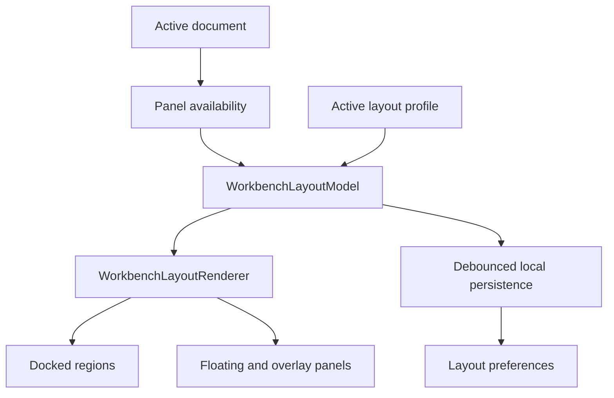
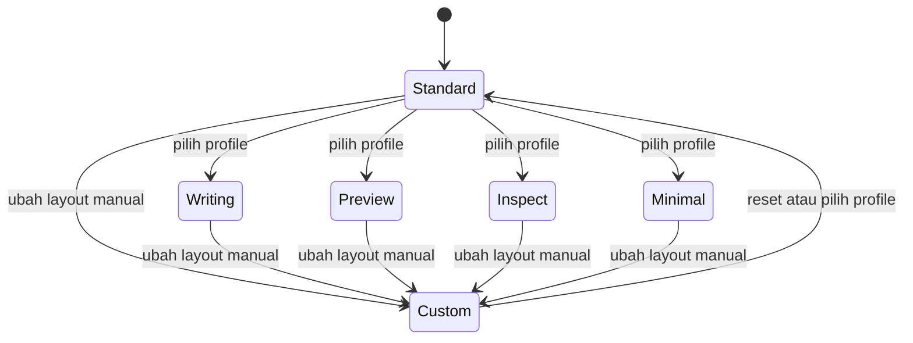

# Sub-Rencana 02 — Workbench Layout dan Panel System

**Status:** Rencana disetujui; implementasi belum dimulai  
**Repository pemilik:** `relgeo/flutter`  
**Pemilik keputusan:** Agus Made  
**Compatibility line:** RelGeo DSL 0.5.x

## 1. Tujuan

Mengubah Flutter workbench dari fixed three-column layout menjadi ruang kerja
yang dapat disusun pengguna seperti IDE/CAD desktop, tanpa mencampurkan state
layout dengan state dokumen RelGeo.

Panel utama:

- Code Editor;
- Preview;
- Inspector;
- Parameters.

Semua panel harus dapat dikelola melalui satu model layout yang konsisten:

- show/hide;
- resize;
- dock dan undock;
- collapse/expand;
- floating atau overlay;
- preset layout;
- autosave layout lokal.

## 2. Batasan desain

### 2.1 Layout bukan theme

Sub-plan ini mengatur geometri dan interaksi ruang kerja. App theme (`Light` /
`Dark`) dan canvas appearance (`CAD Dark`, `Blueprint`, `Paper`) tetap menjadi
tanggung jawab [Sub-Rencana 01](./01-theme-and-modular-workbench.md).

### 2.2 Layout bukan state dokumen

Layout boleh menyimpan posisi, ukuran, visibility, dan profile aktif. Layout
tidak boleh menyimpan source DSL, parameter value dokumen, selection geometry,
atau hasil kompilasi sebagai bagian dari layout preference.

### 2.3 Parameters adalah panel mandiri bersyarat

Parameters menjadi panel terpisah, tetapi hanya tersedia jika dokumen aktif
memiliki parameter yang dapat diedit. Saat parameter tidak tersedia:

- panel tidak ditampilkan sebagai panel kosong;
- menu atau command terkait dapat disabled atau tidak ditawarkan;
- layout pengguna tidak dibuang;
- posisi dan ukuran terakhir dipulihkan ketika parameter muncul kembali.

## 3. Target capability

| Panel | Show/hide | Resize | Dock/undock | Floating/overlay | Collapse |
| --- | --- | --- | --- | --- | --- |
| Code Editor | Ya | Ya | Ya | Ya | Ya |
| Preview | Ya | Ya | Ya | Ya | Ya |
| Inspector | Ya | Ya | Ya | Ya | Ya |
| Parameters | Bersyarat | Ya | Ya | Ya | Ya |

Overlay panel berarti panel UI yang mengambang di atas workbench. Ini berbeda
dari drawing overlay seperti anchor, label, dan bounding box pada Preview.

## 4. Model layout

Gunakan model declarative dan serializable, bukan perubahan langsung yang
tersebar di `CADWorkbenchPage`.



Kontrak minimal yang perlu disediakan:

```text
PanelId
  editor | preview | inspector | parameters

PanelAvailability
  available | unavailable

PanelVisibility
  visible | hidden | collapsed

PanelPlacement
  left | center | right | bottom | floating | overlay

PanelBounds
  width | height | min/max constraints

WorkbenchLayoutModel
  schemaVersion
  activeProfileId
  panel states
  split ratios
  floating bounds
```

Layout renderer perlu memiliki region utama yang stabil, misalnya left, center,
right, bottom, dan floating layer. Panel tidak boleh kehilangan state hanya
karena berpindah region.

## 5. Preset workbench profiles

Preset adalah snapshot layout, bukan theme dan bukan dokumen.

Preset awal yang direkomendasikan:

| Profile | Tujuan |
| --- | --- |
| Standard | Editor kiri, Preview tengah, Inspector kanan, Parameters di bawah editor |
| Writing | Editor dominan, panel pendukung diperkecil |
| Preview | Preview dominan, Editor dan Inspector disembunyikan atau collapsed |
| Inspect | Inspector dominan dengan Preview tetap terlihat |
| Minimal | Editor dan Preview saja |
| Custom | Layout terakhir yang disusun pengguna |



Rekomendasi behavior:

- menerapkan preset tidak mengubah source atau state dokumen;
- perubahan manual setelah memilih preset menjadikan layout sebagai `Custom`;
- profile menyimpan layout panel, bukan nilai parameter;
- setiap profile dapat di-reset ke baseline bawaan;
- reset layout global tersedia dari Settings/View menu.

## 6. Autosave layout

Perubahan berikut harus disimpan lokal secara otomatis:

- panel dipindah atau di-dock ulang;
- panel ditampilkan, disembunyikan, atau di-collapse;
- splitter digeser;
- ukuran floating/overlay panel diubah;
- profile aktif berubah;
- layout menjadi `Custom`.

Policy persistence:

1. gunakan debounce sekitar 300–500 ms setelah perubahan terakhir;
2. flush saat aplikasi pause, close, atau sebelum profile diganti;
3. simpan JSON versioned melalui preference store lokal;
4. jika data rusak atau schema lebih baru, fallback ke profile Standard;
5. sediakan `Reset layout` dan `Reset all profiles`;
6. layout preference tidak pernah menjadi dependency untuk compile dokumen.

Key persistence disarankan memiliki namespace terpisah dari theme dan document
preference, misalnya `workbench.layout.v1`.

## 7. Tahapan implementasi

### Tahap A — Layout contracts

- [ ] definisikan `PanelId`, availability, visibility, placement, dan bounds;
- [ ] definisikan `WorkbenchLayoutModel` immutable dan serializable;
- [ ] pisahkan layout state dari `CADWorkbenchPage`;
- [ ] tambahkan schema version dan fallback layout valid.

### Tahap B — Docked layout dan splitter

- [ ] ganti fixed flex 32/43/25 dengan region layout yang dapat diubah;
- [ ] tambahkan splitter horizontal/vertical dengan min/max constraint;
- [ ] dukung show/hide dan collapse untuk panel utama;
- [ ] pertahankan compact layout tanpa overflow.

### Tahap C — Parameters panel

- [ ] ekstrak Parameters dari `EditorPanel` menjadi feature surface mandiri;
- [ ] hubungkan availability ke parameter dokumen aktif;
- [ ] pulihkan posisi/ukuran saat parameter muncul kembali;
- [ ] pertahankan reset parameter sebagai aksi domain, bukan aksi layout.

### Tahap D — Floating, overlay, dan docking

- [ ] dukung panel floating dengan bounds terkontrol;
- [ ] dukung overlay panel dengan z-order dan dismiss behavior yang jelas;
- [ ] dukung dock kembali ke region asal atau region pilihan;
- [ ] cegah panel keluar sepenuhnya dari batas window.

### Tahap E — Profiles dan autosave

- [ ] tambahkan preset Standard, Writing, Preview, Inspect, Minimal, Custom;
- [ ] tambahkan profile switcher dan reset action;
- [ ] implementasikan debounced autosave versioned;
- [ ] migrasikan/fallback data layout yang invalid;
- [ ] test restart dan pemulihan layout.

### Tahap F — Accessibility dan regression

- [ ] semua panel dan splitter memiliki label semantics;
- [ ] keyboard dapat berpindah, collapse, dan mengaktifkan panel;
- [ ] focus tidak hilang saat panel dipindah;
- [ ] reduced-motion dihormati pada floating/collapse animation;
- [ ] golden dan widget test mencakup setiap preset utama;
- [ ] uji native window pada macOS, Ubuntu, dan Windows 11.

## 8. Acceptance criteria

- [ ] empat panel memiliki lifecycle dan placement yang dapat dikontrol;
- [ ] Parameters tidak muncul ketika dokumen tidak memiliki parameter;
- [ ] panel dapat di-resize tanpa overflow atau kehilangan konten penting;
- [ ] panel dapat di-dock, di-undock, di-collapse, dan di-overlay;
- [ ] preset dapat diterapkan tanpa mengubah dokumen;
- [ ] perubahan layout dipulihkan setelah restart;
- [ ] layout rusak atau tidak dikenal kembali ke Standard dengan aman;
- [ ] layout preference terpisah dari theme dan document persistence;
- [ ] keyboard dan accessibility state tetap dapat digunakan;
- [ ] analyzer, test, golden, web build, dan native build tetap lulus.

## 9. Risiko dan keputusan yang ditunda

| Risiko/keputusan | Rekomendasi awal |
| --- | --- |
| Kompleksitas docking | Mulai dari docked splitter dan collapse, baru floating/overlay |
| Package docking eksternal | Jangan bergantung pada package sebelum kontrak internal stabil |
| Banyak profile | Simpan profile built-in immutable; hanya Custom yang writable |
| Parameter berubah saat runtime | Availability mengikuti dokumen, layout pengguna tetap dipertahankan |
| Window terlalu kecil | Terapkan minimum window dan fallback compact drawer/scroll |
| Autosave terlalu sering | Debounce, schema version, dan atomic preference update |

## 10. Definition of done

Sub-plan ini selesai jika pengguna dapat menyusun empat panel sesuai workflow,
menyimpan susunan itu melalui autosave, memulihkannya setelah restart, dan
berpindah antara preset tanpa mengubah dokumen RelGeo atau merusak aksesibilitas.

