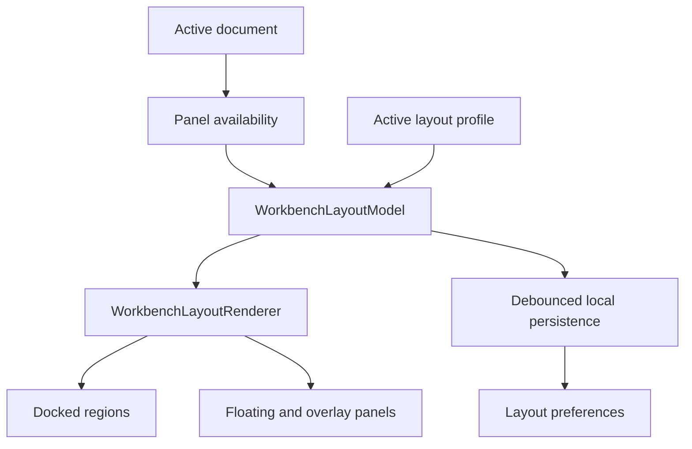
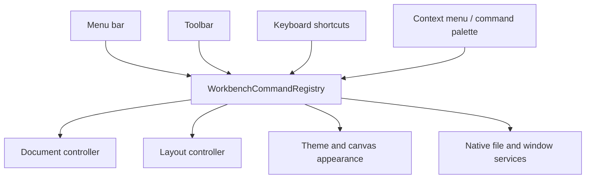
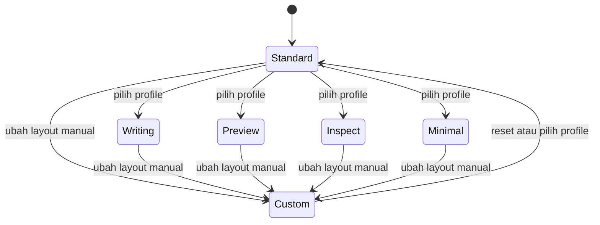

# Sub-Rencana 02 — Workbench Layout dan Panel System

**Status:** Tahap A, B, dan C selesai; Tahap D, E, F, dan G sebagian selesai
**Repository pemilik:** `relgeo/flutter`  
**Pemilik keputusan:** Agus Made  
**Compatibility line:** RelGeo DSL 0.5.x

## 1. Tujuan

Mengubah Flutter workbench dari fixed three-column layout menjadi ruang kerja
yang dapat disusun pengguna seperti IDE/CAD desktop, tanpa mencampurkan state
layout dengan state dokumen RelGeo.

Panel utama:

- Code Editor;
- Preview;
- Inspector;
- Parameters.

Semua panel harus dapat dikelola melalui satu model layout yang konsisten:

- show/hide;
- resize;
- dock dan undock;
- collapse/expand;
- floating atau overlay;
- preset layout;
- autosave layout lokal.

Workbench juga membutuhkan menu bar sebagai command center untuk operasi file,
layout, panel, appearance, document, shortcut, dan bantuan. Toolbar hanya
menampilkan subset aksi yang paling sering digunakan.

## 2. Batasan desain

### 2.1 Layout bukan theme

Sub-plan ini mengatur geometri dan interaksi ruang kerja. App theme (`Light` /
`Dark`) dan canvas appearance (`CAD`, `Blueprint`, `Paper`) tetap menjadi
tanggung jawab [Sub-Rencana 01](./01-theme-and-modular-workbench.md).

### 2.2 Layout bukan state dokumen

Layout boleh menyimpan posisi, ukuran, visibility, dan profile aktif. Layout
tidak boleh menyimpan source DSL, parameter value dokumen, selection geometry,
atau hasil kompilasi sebagai bagian dari layout preference.

### 2.3 Parameters adalah panel mandiri bersyarat

Parameters menjadi panel terpisah, tetapi hanya tersedia jika dokumen aktif
memiliki parameter yang dapat diedit. Saat parameter tidak tersedia:

- panel tidak ditampilkan sebagai panel kosong;
- menu atau command terkait dapat disabled atau tidak ditawarkan;
- layout pengguna tidak dibuang;
- posisi dan ukuran terakhir dipulihkan ketika parameter muncul kembali.

### 2.4 Menu bar dan command surface

Menu bar, toolbar, keyboard shortcut, context menu, dan command palette harus
memanggil command yang sama. Tidak boleh ada logika operasi file atau layout yang
hanya hidup di tombol toolbar.

Struktur menu awal:

```text
File        New, Open, Save, Save As, Recent, Export, Close, Quit
            Export > SVG > Model / Sheet View
Edit        Undo, Redo, Cut, Copy, Paste, Select All, Find
View        Workbench Profile, Panels, Reset Layout, Full Screen
Appearance  App Theme, Canvas Appearance
Document    Compile, Recompile, Validate, Reset Parameters, Reload
Help        Keyboard Shortcuts, Documentation, About RelGeo
```

Setiap command memiliki enabled/disabled state, label, shortcut, dan optional
checked/toggled state. Contoh: `Save` disabled ketika tidak ada perubahan,
`Parameters` disabled atau tidak ditawarkan ketika dokumen tidak memiliki
parameter, dan panel visible ditandai checkmark pada menu `View`.

SVG adalah format export, bukan aksi khusus milik Preview. Toolbar Preview tidak
menampilkan tombol `SVG MODEL`; exporter dan filesystem boundary tetap menjadi
service/command backend yang dapat dipanggil dari `File → Export → SVG`.
Target export mengikuti konteks aktif, yaitu model atau sheet/view.

## 3. Target capability

| Panel | Show/hide | Resize | Dock/undock | Floating/overlay | Collapse |
| --- | --- | --- | --- | --- | --- |
| Code Editor | Ya | Ya | Ya | Ya | Ya |
| Preview | Ya | Ya | Ya | Ya | Ya |
| Inspector | Ya | Ya | Ya | Ya | Ya |
| Parameters | Bersyarat | Ya | Ya | Ya | Ya |

Overlay panel berarti panel UI yang mengambang di atas workbench. Ini berbeda
dari drawing overlay seperti anchor, label, dan bounding box pada Preview.

## 4. Model layout

Gunakan model declarative dan serializable, bukan perubahan langsung yang
tersebar di `CADWorkbenchPage`.





Kontrak minimal yang perlu disediakan:

```text
PanelId
  editor | preview | inspector | parameters

PanelAvailability
  available | unavailable

PanelVisibility
  visible | hidden | collapsed

PanelPlacement
  left | center | right | bottom | floating | overlay

PanelBounds
  width | height | min/max constraints

WorkbenchLayoutModel
  schemaVersion
  activeProfileId
  panel states
  split ratios
  floating bounds
```

Layout renderer perlu memiliki region utama yang stabil, misalnya left, center,
right, bottom, dan floating layer. Panel tidak boleh kehilangan state hanya
karena berpindah region.

## 5. Preset workbench profiles

Preset adalah snapshot layout, bukan theme dan bukan dokumen.

Preset awal yang direkomendasikan:

| Profile | Tujuan |
| --- | --- |
| Standard | Editor kiri, Preview tengah, Inspector kanan, Parameters di bawah editor |
| Writing | Editor dominan, panel pendukung diperkecil |
| Preview | Preview dominan, Editor dan Inspector disembunyikan atau collapsed |
| Inspect | Inspector dominan dengan Preview tetap terlihat |
| Minimal | Editor dan Preview saja |
| Custom | Layout terakhir yang disusun pengguna |



Rekomendasi behavior:

- menerapkan preset tidak mengubah source atau state dokumen;
- perubahan manual setelah memilih preset menjadikan layout sebagai `Custom`;
- profile menyimpan layout panel, bukan nilai parameter;
- setiap profile dapat di-reset ke baseline bawaan;
- reset layout global tersedia dari Settings/View menu.

## 6. Autosave layout

Perubahan berikut harus disimpan lokal secara otomatis:

- panel dipindah atau di-dock ulang;
- panel ditampilkan, disembunyikan, atau di-collapse;
- splitter digeser;
- ukuran floating/overlay panel diubah;
- profile aktif berubah;
- layout menjadi `Custom`.

Policy persistence:

1. gunakan debounce sekitar 300–500 ms setelah perubahan terakhir;
2. flush saat aplikasi pause, close, atau sebelum profile diganti;
3. simpan JSON versioned melalui preference store lokal;
4. jika data rusak atau schema lebih baru, fallback ke profile Standard;
5. sediakan `Reset layout` dan `Reset all profiles`;
6. layout preference tidak pernah menjadi dependency untuk compile dokumen.

Key persistence disarankan memiliki namespace terpisah dari theme dan document
preference, misalnya `workbench.layout.v1`.

## 7. Tahapan implementasi

### Tahap A — Layout contracts

- [x] definisikan `PanelId`, availability, visibility, placement, dan bounds;
- [x] definisikan `WorkbenchLayoutModel` immutable dan serializable;
- [x] letakkan model layout sebagai boundary terpisah dari `CADWorkbenchPage`;
- [x] tambahkan schema version dan fallback layout valid.

### Tahap B — Docked layout dan splitter

- [x] ganti fixed flex 32/43/25 dengan region layout yang dapat diubah ketika
  `WorkbenchLayoutController` dipasang;
- [x] tambahkan splitter horizontal untuk tiga region utama dengan min-width
  constraint dan pembaruan split ratio;
- [x] dukung show/hide dan collapse untuk Editor, Preview, dan Inspector;
- [x] pertahankan compact layout tanpa overflow melalui minimum workbench width
  dan horizontal scroll;
- [x] integrasikan Parameters sebagai surface mandiri di region bawah ketika
  dokumen menyediakannya;

Catatan implementasi: shell masih mempertahankan jalur fixed-layout lama ketika
controller tidak diberikan agar komponen dapat dipakai secara bertahap. Jalur
workbench utama sekarang memasang controller sehingga visibility, collapse, dan
splitter benar-benar aktif. Floating, overlay, dan docking ulang tetap menjadi
ruang lingkup Tahap D.

### Tahap C — Parameters panel

- [x] ekstrak Parameters dari `EditorPanel` menjadi feature surface mandiri;
- [x] hubungkan availability ke parameter dokumen aktif; shell tidak memasang
  feature ketika dokumen tidak memiliki parameter;
- [x] pulihkan posisi/ukuran saat parameter muncul kembali melalui layout
  state yang dipertahankan;
- [x] pertahankan reset parameter sebagai aksi domain, bukan aksi layout.

### Tahap D — Floating, overlay, dan docking

- [x] dukung panel floating dengan bounds terkontrol, posisi yang dapat
  dipindahkan, dan resize handle dengan batas ukuran;
- [x] dukung overlay panel dengan z-order tersimpan dan explicit close action;
  panel yang disentuh/di-drag dibawa ke depan;
- [x] dukung dock kembali ke region pilihan melalui command `Workbench`;
- [x] dukung drag-to-dock melalui zona drop kiri, tengah, kanan, dan bawah
  khusus Parameters; kebijakan zona dipusatkan di layout controller;
- [x] cegah panel keluar sepenuhnya dari batas canvas saat drag/resize dan
  pertahankan batas ukuran minimum/maksimum;

### Tahap E — Profiles dan autosave

- [x] definisikan preset Standard, Writing, Preview, Inspect, dan Minimal
  sebagai model layout immutable;
- [x] tambahkan profile switcher dan reset action melalui command surface menu
  `Workbench` dan `View`;
- [x] implementasikan controller debounced autosave versioned dan hubungkan ke
  perubahan layout pada `CADWorkbenchPage`;
- [x] migrasikan/fallback data layout yang invalid ke Standard;
- [~] test load/flush dan pemulihan layout sudah tersedia; restart penuh di
  platform native masih tertunda.

### Tahap F — Menu bar dan command registry

- [x] definisikan command ID, label, shortcut, enabled state, dan checked state;
- [x] implementasikan menu `File`, `Edit`, `View`, `Appearance`, `Document`,
  `Workbench`, dan `Help` pada menu bar in-window serta adapter native macOS;
- [x] tempatkan SVG di `File → Export → SVG → Model / Sheet View`, bukan sebagai
  tombol khusus pada Preview; toolbar tetap mengekspor surface aktif sebagai
  affordance cepat.
- [~] hubungkan menu dengan document, layout, theme, canvas, dan native
  services; layout/theme/document actions dan export target Model/Sheet sudah
  aktif, sedangkan native file I/O penuh dan host lifecycle masih bergantung
  pada service/host aplikasi;
- [~] pastikan toolbar dan keyboard shortcut memakai command yang sama; global
  shortcuts sekarang dipasang dari registry yang sama dengan menu dan command
  callback, tetapi parity seluruh toolbar/context menu belum selesai;
- [x] dukung checkmark untuk panel yang aktif pada menu View;
- [x] dukung disabled state berdasarkan dokumen dan panel yang tersedia;
- [~] sediakan reset layout, reset appearance override, dan reset parameters;
  reset layout, reset parameter, dan kembali ke system appearance sudah ada,
  tetapi reset global yang menyatukan seluruh preference masih tertunda;
- [x] tambahkan test command availability dan activation untuk command registry
  serta toggle panel utama;
- [~] menu File/Edit/Appearance/Document/Help kini memiliki command surface
  dasar: callback New/Open/Save, Copy source, Recompile, Reset parameter, dan
  About. Callback Save As/Close/Quit kini juga tersedia; implementasi file I/O
  native untuk Open/Save/Save As kini memiliki `WorkbenchFileService` dan
  adapter `file_picker`; New/Close/Quit tetap callback aplikasi, sedangkan
  undo/redo editor kini aktif melalui history native `re_editor`, sedangkan
  shortcut parity penuh masih tertunda.

### Tahap G — Accessibility dan regression

- [~] semua panel dan splitter memiliki label semantics; surface floating,
  collapsed, splitter, dan resize handle sudah berlabel, tetapi audit semantics
  end-to-end untuk seluruh child feature belum selesai;
- [~] keyboard dapat berpindah, collapse, dan mengaktifkan panel; menu command,
  shortcut, focus boundary floating/overlay, dan Escape sudah aktif, sedangkan
  traversal antar-region serta keyboard resize/collapse langsung masih tertunda;
- [~] focus tidak hilang saat panel dipindah; pointer activation dan focus
  order floating sudah tersedia, tetapi restoration setelah docking belum;
- [x] reduced-motion dihormati pada transisi workbench yang sudah memiliki
  motion policy;
- [~] golden dan widget test mencakup setiap preset utama; shell golden light/
  dark dan profile/widget coverage sudah tersedia, tetapi golden khusus setiap
  preset belum dibuat;
- [ ] uji native window pada macOS, Ubuntu, dan Windows 11.

## 8. Acceptance criteria

- [~] empat panel memiliki lifecycle dan placement yang dapat dikontrol;
  show/hide, resize, collapse, float, overlay, dan command placement sudah ada;
  drag-to-dock serta native focus integration belum;
- [x] Parameters tidak muncul ketika dokumen tidak memiliki parameter;
- [x] panel dapat di-resize tanpa overflow atau kehilangan konten penting;
- [x] panel dapat di-collapse, di-dock melalui command maupun drag-to-dock,
  di-float, dan di-overlay; transisi visual floating lanjutan masih dapat
  dipoles tanpa mengubah kontrak placement;
- [x] preset dapat diterapkan tanpa mengubah dokumen;
- [x] perubahan layout dipulihkan melalui persistence reload; verifikasi restart
  native penuh masih menjadi bagian uji platform;
- [x] layout rusak atau tidak dikenal kembali ke Standard dengan aman;
- [x] layout preference terpisah dari theme dan document persistence;
- [~] keyboard dan accessibility state tetap dapat digunakan; jalur menu,
  shortcut, semantics, dan Escape sudah diuji, tetapi traversal menyeluruh
  antar-region belum;
- [~] analyzer, test, golden, dan web build tetap lulus; native build masih
  menunggu validasi macOS/Ubuntu/Windows 11;
- [~] menu bar, toolbar, shortcut, dan context menu menghasilkan efek command
  yang sama; menu bar/native menu dan sebagian toolbar sudah memakai registry,
  tetapi parity penuh toolbar/context/shortcut belum;
- [x] command disabled tidak dapat dijalankan melalui menu maupun `invoke()`;
- [x] state checkmark menu mengikuti state layout aktual untuk panel dan profile;
- [x] tidak ada aksi `SVG MODEL` khusus pada toolbar Preview;

## 9. Risiko dan keputusan yang ditunda

| Risiko/keputusan | Rekomendasi awal |
| --- | --- |
| Kompleksitas docking | Mulai dari docked splitter dan collapse, baru floating/overlay |
| Package docking eksternal | Jangan bergantung pada package sebelum kontrak internal stabil |
| Banyak profile | Simpan profile built-in immutable; hanya Custom yang writable |
| Parameter berubah saat runtime | Availability mengikuti dokumen, layout pengguna tetap dipertahankan |
| Window terlalu kecil | Terapkan minimum window dan fallback compact drawer/scroll |
| Autosave terlalu sering | Debounce, schema version, dan atomic preference update |
| Menu dan toolbar tidak sinkron | Satu `WorkbenchCommandRegistry` sebagai sumber kebenaran |
| Command aktif pada state yang salah | Centralized availability predicate dan command tests |

## 10. Definition of done

Sub-plan ini selesai jika pengguna dapat menyusun empat panel sesuai workflow,
menyimpan susunan itu melalui autosave, memulihkannya setelah restart, dan
berpindah antara preset tanpa mengubah dokumen RelGeo atau merusak aksesibilitas.

## 11. Decision log

| Tanggal | Keputusan |
| --- | --- |
| 2026-09-27 | Tombol khusus `Download SVG Model` tidak menjadi bagian dari Preview. SVG diposisikan sebagai salah satu format pada command `File → Export`, dengan target Model atau Sheet/View. |
| 2026-09-27 | Tahap A — Layout contracts | Menambahkan `WorkbenchLayoutModel` immutable dan versioned dengan panel Editor, Preview, Inspector, dan Parameters; visibility, placement, bounds, split ratios, floating bounds, JSON round-trip, serta fallback aman ke Standard. Availability panel sengaja tidak dipersist karena diturunkan dari dokumen aktif. Contract tests lulus; integrasi renderer/layout runtime ditunda ke Tahap B. |
| 2026-09-27 | Tahap B selesai — Docked shell | `WorkbenchLayoutController` menggerakkan shell utama untuk Editor, Preview, Inspector, dan Parameters: visibility, collapse, splitter horizontal/vertikal, min-width constraint, split ratio, dan bottom surface. Jalur compact tetap memiliki scroll boundary. Floating/overlay/docking ulang tetap menjadi ruang lingkup Tahap D. |
| 2026-09-27 | Tahap F parsial — Panel commands | Menu View kini memiliki toggle Editor, Preview, dan Inspector dengan checkmark yang mengikuti state layout. Command registry tetap menjadi sumber aksi; menu File/Edit/Appearance/Document/Help lengkap dan Parameters menunggu tahap berikutnya. |
| 2026-09-27 | Tahap C selesai — Parameters surface | Slider parameter dipindahkan dari `EditorPanel` ke `WorkbenchParametersFeature`/`ParametersPanel`. `CADWorkbenchPage` hanya memasangnya bila dokumen aktif memiliki parameter; reset tetap callback domain, bukan operasi layout. Ukuran bottom region ikut layout state dan dipulihkan saat panel tersedia kembali. |
| 2026-09-27 | Tahap E parsial — Profiles dan autosave | Menambahkan preset layout immutable (`Standard`, `Writing`, `Preview`, `Inspect`, `Minimal`) serta persistence JSON versioned dengan debounce 400 ms, flush, dan fallback corruption ke Standard. `CADWorkbenchPage` memulihkan layout dan menjadwalkan autosave; native restart proof masih tertunda. |
| 2026-09-27 | Tahap B/C selesai — Resizing dan Parameters | Menambahkan vertical splitter untuk Parameters dengan min/max height, serta mempertahankan ukuran panel saat availability Parameters berubah. Seluruh panel utama kini memiliki jalur resize yang dapat diuji pada controller/shell. |
| 2026-09-27 | Tahap E/F parsial — Profile commands | Menu `Workbench` menyediakan preset layout dan menu `View` menyediakan reset layout serta toggle Parameters yang disabled ketika dokumen tidak memiliki parameter. Edit manual mengubah active profile menjadi `Custom`. |
| 2026-09-27 | Tahap D parsial — Floating/overlay foundation | Menambahkan `left`/`top` pada bounds, layer `Stack`, renderer `Positioned`, pembedaan elevation untuk floating/overlay, semantics label, drag gesture, resize handle dengan clamp canvas dan batas ukuran, serta tombol close eksplisit untuk overlay. Docking ulang dan focus/activation order masih tertunda. |
| 2026-09-27 | Tahap D parsial — Floating collapse | State `collapsed` kini konsisten pada panel docked maupun floating/overlay: panel berubah menjadi rail/header ringkas, ukuran dan posisi floating tetap dapat dipulihkan, dan resize handle disembunyikan saat collapsed. |
| 2026-09-27 | Tahap D parsial — Placement commands | Menu `Workbench` kini menyediakan perintah dock ke region pilihan, float, dan overlay untuk setiap panel. Parameters otomatis disabled ketika dokumen aktif tidak memiliki parameter. Drag-to-dock dan focus/activation order multi-panel masih tertunda. |
| 2026-09-27 | Tahap F parsial — Menu skeleton | Menu registry kini mencakup File, Edit, View, Appearance, Document, Workbench, dan Help. File actions menerima callback host opsional; command dasar copy/recompile/reset/about sudah aktif, sementara file I/O, undo/redo, dan shortcut parity lintas host masih tertunda. |
| 2026-09-27 | Tahap D parsial — Floating focus order | `floatingOrder` dipersist bersama layout; placement command, tap, dan drag memperbarui order sehingga panel aktif berada di depan. Drag-to-dock, focus keyboard, dan focus policy native masih tertunda. |
| 2026-09-27 | Tahap G parsial — Floating keyboard focus | Floating/overlay panel memiliki focus boundary, aktivasi pointer membawa focus, dan `Escape` menutup overlay aktif. Keyboard traversal antar-region dan focus restoration setelah docking masih tertunda. |
| 2026-09-27 | Tahap F parsial — Global command shortcuts | Menambahkan `WorkbenchCommandSurface` yang memasang shortcut global dari command registry. Menu, shortcut global, dan callback command kini melewati enabled-state yang sama; parity toolbar/context menu dan shortcut untuk seluruh command masih tertunda. |
| 2026-09-27 | Tahap D — Drag-to-dock | Floating/overlay panel kini mengevaluasi zona drop dari posisi center panel dan berpindah ke placement kiri, tengah, kanan, atau bottom untuk Parameters. Keputusan ini berada di controller agar gesture pointer/touch/pen konsisten. |
| 2026-09-27 | Tahap F parsial — File lifecycle callbacks | Command registry dan `CADWorkbenchPage` kini menyediakan `New`, `Open`, `Save`, `Save As`, `Close`, dan `Quit` melalui callback host opsional. Command otomatis disabled ketika host belum memasang handler; dialog/file picker native masih menjadi tanggung jawab host service. |
| 2026-09-27 | Tahap F parsial — Panel collapse commands | Menu `View` kini menyediakan command collapse/expand terpisah untuk Editor, Preview, Inspector, dan Parameters. Checkmark mengikuti visibility state aktual dan Parameters tetap disabled tanpa parameter dokumen. |
| 2026-09-27 | Tahap F parsial — File service boundary | Menambahkan `WorkbenchFileService` serta `FilePickerWorkbenchFileService` untuk Open, Save, dan Save As berbasis UTF-8 YAML/RelGeo. `CADWorkbenchPage` mengadopsi service secara opsional tanpa memutus callback lifecycle lama; New/Close/Quit tetap dimiliki host aplikasi. |
| 2026-09-27 | Tahap F parsial — Editor history commands | Menu `Edit` dan shortcut global kini menyediakan Undo/Redo dengan enabled-state yang diturunkan dari history native `re_editor`; toolbar/context-menu parity dan kebijakan history lintas dokumen masih tertunda. |
| 2026-09-27 | Tahap F parsial — Hierarchical SVG export | Menu File kini memiliki jalur `Export → SVG → Model / Sheet View`; command target Sheet disabled tanpa sheet aktif. Tombol toolbar tetap menjadi shortcut untuk export surface aktif, bukan menu export terpisah. |
