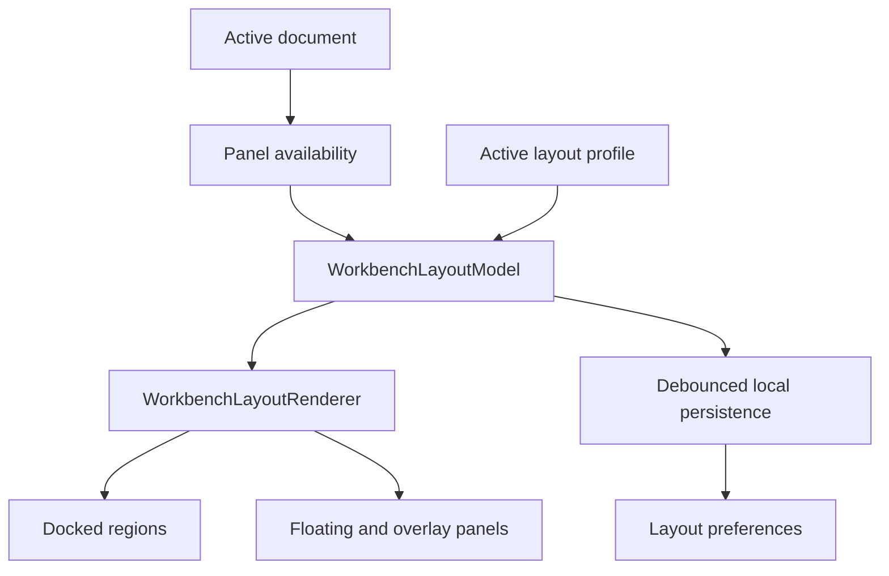
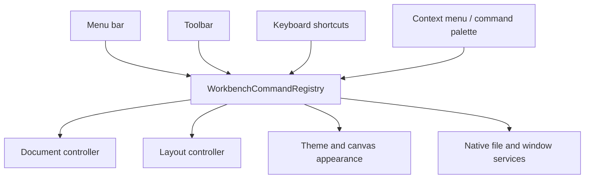
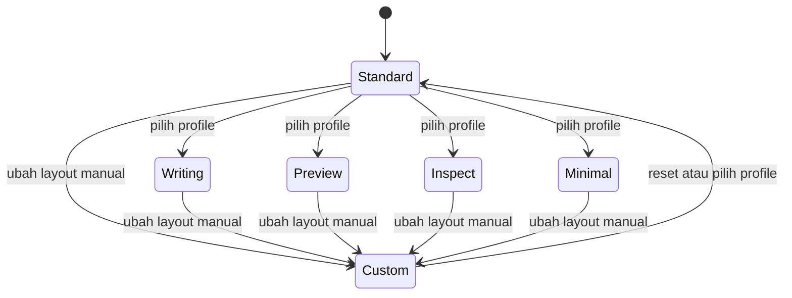

# Sub-Rencana 02 — Workbench Layout dan Panel System

**Status:** Tahap A, B, dan C selesai; Tahap D, E, F, dan G sebagian selesai
**Repository pemilik:** `relgeo/flutter`  
**Pemilik keputusan:** Agus Made  
**Compatibility line:** RelGeo DSL 0.5.x

## 1. Tujuan

Mengubah Flutter workbench dari fixed three-column layout menjadi ruang kerja
yang dapat disusun pengguna seperti IDE/CAD desktop, tanpa mencampurkan state
layout dengan state dokumen RelGeo.

Panel utama:

- Code Editor;
- Preview;
- Inspector;
- Parameters.

Semua panel harus dapat dikelola melalui satu model layout yang konsisten:

- show/hide;
- resize;
- dock dan undock;
- collapse/expand;
- floating atau overlay;
- preset layout;
- autosave layout lokal.

Workbench juga membutuhkan menu bar sebagai command center untuk operasi file,
layout, panel, appearance, document, shortcut, dan bantuan. Toolbar hanya
menampilkan subset aksi yang paling sering digunakan.

## 2. Batasan desain

### 2.1 Layout bukan theme

Sub-plan ini mengatur geometri dan interaksi ruang kerja. App theme (`Light` /
`Dark`) dan canvas appearance (`CAD`, `Blueprint`, `Paper`) tetap menjadi
tanggung jawab [Sub-Rencana 01](./01-theme-and-modular-workbench.md).

### 2.2 Layout bukan state dokumen

Layout boleh menyimpan posisi, ukuran, visibility, dan profile aktif. Layout
tidak boleh menyimpan source DSL, parameter value dokumen, selection geometry,
atau hasil kompilasi sebagai bagian dari layout preference.

### 2.3 Parameters adalah panel mandiri bersyarat

Parameters menjadi panel terpisah, tetapi hanya tersedia jika dokumen aktif
memiliki parameter yang dapat diedit. Saat parameter tidak tersedia:

- panel tidak ditampilkan sebagai panel kosong;
- menu atau command terkait dapat disabled atau tidak ditawarkan;
- layout pengguna tidak dibuang;
- posisi dan ukuran terakhir dipulihkan ketika parameter muncul kembali.

### 2.4 Menu bar dan command surface

Menu bar, toolbar, keyboard shortcut, context menu, dan command palette harus
memanggil command yang sama. Tidak boleh ada logika operasi file atau layout yang
hanya hidup di tombol toolbar.

Struktur menu awal:

```text
File        New, Open, Save, Save As, Recent, Export, Close, Quit
            Export > SVG > Model / Sheet View
Edit        Undo, Redo, Cut, Copy, Paste, Select All, Find
View        Workbench Profile, Panels, Appearance, Reset Layout, Full Screen
            Panels > Code editor, Preview, Inspector, Parameters
            Appearance > App Theme, Canvas Appearance
Document    Compile, Recompile, Validate, Reset Parameters, Reload
Help        Keyboard Shortcuts, Documentation, About RelGeo
```

Setiap command memiliki enabled/disabled state, label, shortcut, dan optional
checked/toggled state. Contoh: `Save` disabled ketika tidak ada perubahan,
`Parameters` disabled atau tidak ditawarkan ketika dokumen tidak memiliki
parameter, dan panel visible ditandai checkmark pada `View → Panels`.

Collapse dilakukan melalui icon button di pojok kanan atas header panel
masing-masing; collapse tidak menjadi command menu terpisah.

SVG adalah format export, bukan aksi khusus milik Preview. Toolbar Preview tidak
menampilkan tombol `SVG MODEL`; exporter dan filesystem boundary tetap menjadi
service/command backend yang dapat dipanggil dari `File → Export → SVG`.
Target export mengikuti konteks aktif, yaitu model atau sheet/view.

## 3. Target capability

| Panel | Show/hide | Resize | Dock/undock | Floating/overlay | Collapse |
| --- | --- | --- | --- | --- | --- |
| Code Editor | Ya | Ya | Ya | Ya | Ya |
| Preview | Ya | Ya | Ya | Ya | Ya |
| Inspector | Ya | Ya | Ya | Ya | Ya |
| Parameters | Bersyarat | Ya | Ya | Ya | Ya |

Overlay panel berarti panel UI yang mengambang di atas workbench. Ini berbeda
dari drawing overlay seperti anchor, label, dan bounding box pada Preview.

## 4. Model layout

Gunakan model declarative dan serializable, bukan perubahan langsung yang
tersebar di `CADWorkbenchPage`.





Kontrak minimal yang perlu disediakan:

```text
PanelId
  editor | preview | inspector | parameters

PanelAvailability
  available | unavailable

PanelVisibility
  visible | hidden | collapsed

PanelPlacement
  left | center | right | bottom | floating | overlay

PanelBounds
  width | height | min/max constraints

WorkbenchLayoutModel
  schemaVersion
  activeProfileId
  panel states
  split ratios
  floating bounds
```

Layout renderer perlu memiliki region utama yang stabil, misalnya left, center,
right, bottom, dan floating layer. Panel tidak boleh kehilangan state hanya
karena berpindah region.

## 5. Preset workbench profiles

Preset adalah snapshot layout, bukan theme dan bukan dokumen.

Preset awal yang direkomendasikan:

| Profile | Tujuan |
| --- | --- |
| Standard | Editor kiri, Preview tengah, Inspector kanan, Parameters di bawah editor |
| Writing | Editor dominan, panel pendukung diperkecil |
| Preview | Preview dominan, Editor dan Inspector disembunyikan atau collapsed |
| Inspect | Inspector dominan dengan Preview tetap terlihat |
| Minimal | Editor dan Preview saja |
| Custom | Layout terakhir yang disusun pengguna |



Rekomendasi behavior:

- menerapkan preset tidak mengubah source atau state dokumen;
- perubahan manual setelah memilih preset menjadikan layout sebagai `Custom`;
- profile menyimpan layout panel, bukan nilai parameter;
- setiap profile dapat di-reset ke baseline bawaan;
- reset layout global tersedia dari Settings/View menu.

## 6. Autosave layout

Perubahan berikut harus disimpan lokal secara otomatis:

- panel dipindah atau di-dock ulang;
- panel ditampilkan, disembunyikan, atau di-collapse;
- splitter digeser;
- ukuran floating/overlay panel diubah;
- profile aktif berubah;
- layout menjadi `Custom`.

Policy persistence:

1. gunakan debounce sekitar 300–500 ms setelah perubahan terakhir;
2. flush saat aplikasi pause, close, atau sebelum profile diganti;
3. simpan JSON versioned melalui preference store lokal;
4. jika data rusak atau schema lebih baru, fallback ke profile Standard;
5. sediakan `Reset layout` dan `Reset all profiles`;
6. layout preference tidak pernah menjadi dependency untuk compile dokumen.

Key persistence disarankan memiliki namespace terpisah dari theme dan document
preference, misalnya `workbench.layout.v1`.

## 7. Tahapan implementasi

### Tahap A — Layout contracts

- [x] definisikan `PanelId`, availability, visibility, placement, dan bounds;
- [x] definisikan `WorkbenchLayoutModel` immutable dan serializable;
- [x] letakkan model layout sebagai boundary terpisah dari `CADWorkbenchPage`;
- [x] tambahkan schema version dan fallback layout valid.

### Tahap B — Docked layout dan splitter

- [x] ganti fixed flex 32/43/25 dengan region layout yang dapat diubah ketika
  `WorkbenchLayoutController` dipasang;
- [x] tambahkan splitter horizontal untuk tiga region utama dengan min-width
  constraint dan pembaruan split ratio;
- [x] dukung show/hide dan collapse untuk Editor, Preview, dan Inspector;
- [x] pertahankan compact layout tanpa overflow melalui minimum workbench width
  dan horizontal scroll;
- [x] integrasikan Parameters sebagai surface mandiri di region bawah ketika
  dokumen menyediakannya;

Catatan implementasi: shell masih mempertahankan jalur fixed-layout lama ketika
controller tidak diberikan agar komponen dapat dipakai secara bertahap. Jalur
workbench utama sekarang memasang controller sehingga visibility, collapse, dan
splitter benar-benar aktif. Floating, overlay, dan docking ulang tetap menjadi
ruang lingkup Tahap D.

### Tahap C — Parameters panel

- [x] ekstrak Parameters dari `EditorPanel` menjadi feature surface mandiri;
- [x] hubungkan availability ke parameter dokumen aktif; shell tidak memasang
  feature ketika dokumen tidak memiliki parameter;
- [x] pulihkan posisi/ukuran saat parameter muncul kembali melalui layout
  state yang dipertahankan;
- [x] pertahankan reset parameter sebagai aksi domain, bukan aksi layout.

### Tahap D — Floating, overlay, dan docking

- [x] dukung panel floating dengan bounds terkontrol, posisi yang dapat
  dipindahkan, dan resize handle dengan batas ukuran;
- [x] dukung overlay panel dengan z-order tersimpan dan explicit close action;
  panel yang disentuh/di-drag dibawa ke depan;
- [x] dukung dock kembali ke region pilihan melalui command `Workbench`;
- [x] dukung drag-to-dock melalui zona drop kiri, tengah, kanan, dan bawah
  khusus Parameters; kebijakan zona dipusatkan di layout controller;
- [x] cegah panel keluar sepenuhnya dari batas canvas saat drag/resize dan
  pertahankan batas ukuran minimum/maksimum;

### Tahap E — Profiles dan autosave

- [x] definisikan preset Standard, Writing, Preview, Inspect, dan Minimal
  sebagai model layout immutable;
- [x] tambahkan profile switcher dan reset action melalui command surface menu
  `Workbench` dan `View`;
- [x] implementasikan controller debounced autosave versioned dan hubungkan ke
  perubahan layout pada `CADWorkbenchPage`;
- [x] migrasikan/fallback data layout yang invalid ke Standard;
- [x] test load/flush dan pemulihan layout tersedia; restart native macOS juga
  sudah diverifikasi: setelah aplikasi ditutup dan dibuka kembali, preset
  `Standard` serta `Follow system appearance` dipulihkan tanpa assertion.

### Tahap F — Menu bar dan command registry

- [x] definisikan command ID, label, shortcut, enabled state, dan checked state;
- [x] implementasikan menu `File`, `Edit`, `View`, `Appearance`, `Document`,
  `Workbench`, dan `Help` pada menu bar in-window serta adapter native macOS;
- [x] tempatkan SVG di `File → Export → SVG → Model / Sheet View`, bukan sebagai
  tombol khusus pada Preview; toolbar tetap mengekspor surface aktif sebagai
  affordance cepat.
- [~] hubungkan menu dengan document, layout, theme, canvas, dan native
  services; layout/theme/document actions dan export target Model/Sheet sudah
  aktif, sedangkan native file I/O penuh dan host lifecycle masih bergantung
  pada service/host aplikasi;
- [~] pastikan toolbar, context menu, dan keyboard shortcut memakai command
  yang sama; global shortcuts dan toolbar utama/viewport sudah memakai registry,
  dan viewport/editor/inspector/parameters kini memiliki context menu berbasis
  registry sesuai surface. Shortcut aman untuk New/Open/Save dan Recompile
  sekarang juga terdaftar; command layout, appearance, dan sebagian navigasi
  visual tetap sengaja diakses melalui menu, toolbar, atau context menu agar
  tidak membebani keyboard global;
- [x] dukung checkmark untuk panel yang aktif pada menu View;
- [x] dukung disabled state berdasarkan dokumen dan panel yang tersedia;
- [x] kelompokkan toggle panel di `View → Panels`, pindahkan appearance ke
  `View → Appearance`, dan tampilkan checkmark panel yang sedang visible;
- [x] pindahkan collapse dari menu ke icon button pada header Editor, Preview,
  Inspector, dan Parameters;
- [x] sediakan reset layout, reset appearance override, dan reset parameters;
  reset global workbench kini menyatukan layout, appearance override, overlay,
  dan role filter, sementara reset parameter tetap mengikuti dokumen aktif;
- [x] tambahkan test command availability dan activation untuk command registry
  serta toggle panel utama;
- [~] menu File/Edit/View/Document/Help kini memiliki command surface
  dasar: callback New/Open/Save, Copy source, Recompile, Reset parameter, dan
  About. Callback Save As/Close/Quit kini juga tersedia; implementasi file I/O
  native untuk Open/Save/Save As kini memiliki `WorkbenchFileService`, adapter
  `file_picker`, dan sudah dipasang pada aplikasi default. Extension
  `WorkbenchDocumentFileService` juga dapat mempertahankan nama/path dokumen
  secara opsional; New kini memiliki fallback dokumen minimal lokal ketika file
  service tersedia, sementara callback host tetap diprioritaskan. Quit kini
  dapat memakai lifecycle host native opsional, sedangkan Close document tetap
  callback aplikasi; undo/redo editor kini aktif melalui history native
  `re_editor`, dan shortcut
  parity penuh masih tertunda. `WorkbenchDocumentSession` kini melacak dirty
  state; jalur file service menandai sesi bersih setelah Save. Host juga dapat
  memakai `onSaveDocumentWithResult` untuk mengembalikan acknowledgement typed
  beserta identitas file; callback `VoidCallback` lama tetap tersedia sebagai
  jalur kompatibilitas tetapi tidak dapat melaporkan hasil Save.

### Tahap G — Accessibility dan regression

- [~] semua panel dan splitter memiliki label semantics; surface floating,
  collapsed, splitter, resize handle, object expand/collapse, parameter reset,
  dan parameter slider kini memiliki label/value/hint yang bermakna. Editor
  autocomplete suggestions kini menjadi control keyboard/semantics dengan
  label, selection state, dan activation action. Splitter dan floating resize
  handle juga mengekspos aksi semantic increase/decrease. Audit semantics
  end-to-end untuk seluruh child feature serta verifikasi VoiceOver/TalkBack
  nyata belum selesai;
- [~] keyboard dapat berpindah, collapse, dan mengaktifkan panel; menu command,
  shortcut, focus boundary floating/overlay, Escape, dan traversal panel-level
  Editor → Preview → Inspector sudah aktif, sedangkan traversal seluruh child
  control masih tertunda; splitter dapat di-resize dengan arrow key dan rail
  collapsed memiliki semantic activation untuk dipulihkan; splitter docked dan
  floating resize handle menerima arrow key;
- [x] focus tidak hilang saat panel dipindah; pointer activation, focus order
  floating, dan restoration ke panel docked setelah drop sudah tersedia;
- [x] reduced-motion dihormati pada transisi workbench yang sudah memiliki
  motion policy;
- [x] golden dan widget test mencakup setiap preset utama; tersedia baseline
  golden terpisah untuk Standard, Writing, Preview, Inspect, dan Minimal;
- [~] validasi native window kini mencakup build macOS arm64 melalui Flutter
  pada terminal VSCode native-arm64, build Xcode universal melalui direct
  `xcodebuild`, launch smoke, menu Appearance, preset Workbench Writing →
  Standard, serta smoke `Workbench → Float Code editor → Dock Code editor left`.
  Binary terbaru juga memverifikasi menu `View` tanpa top-level `Appearance`,
  header Float/Collapse, dan drag handle floating yang terlihat. Restart/
  persistence native macOS lulus untuk state tema/layout. Interaksi drag
  pointer langsung, resize pointer native, validasi Ubuntu/Windows 11, dan
  packaging produksi masih tertunda;

## 8. Acceptance criteria

- [~] empat panel memiliki lifecycle dan placement yang dapat dikontrol;
  show/hide, resize, collapse, float, overlay, dan command placement sudah ada;
  drag-to-dock dan focus restoration setelah docking sudah ada; integrasi focus
  native window masih tertunda;
- [~] lifecycle dokumen memiliki dirty-state dan guard konfirmasi untuk
  New/Open/Close/Quit; persistence identity dan file-service Save sudah
  mengembalikan state bersih, dan host kini memiliki callback Save typed yang
  dapat mengembalikan `saved`, path, serta name. Callback Save legacy tetap
  didukung, tetapi sengaja tidak dapat memberi acknowledgement hasil;
- [x] Parameters tidak muncul ketika dokumen tidak memiliki parameter;
- [x] panel dapat di-resize tanpa overflow atau kehilangan konten penting;
- [x] panel dapat di-collapse, di-dock melalui command maupun drag-to-dock,
  di-float, dan di-overlay; transisi visual floating lanjutan masih dapat
  dipoles tanpa mengubah kontrak placement;
- [x] preset dapat diterapkan tanpa mengubah dokumen;
- [x] perubahan layout dipulihkan melalui persistence reload; restart native
  macOS diverifikasi dengan preset Standard dan state system appearance;
- [x] layout rusak atau tidak dikenal kembali ke Standard dengan aman;
- [x] layout preference terpisah dari theme dan document persistence;
- [~] keyboard dan accessibility state tetap dapat digunakan; jalur menu,
  shortcut, semantics, Escape, traversal panel-level, object expand/collapse,
  dan parameter controls sudah memiliki boundary yang dapat diakses, tetapi
  traversal menyeluruh antar-child control serta verifikasi VoiceOver/TalkBack
  nyata belum; keyboard resize splitter dan aktivasi rail collapsed serta
  keyboard resize docked/floating sudah diuji/tersedia;
- [~] analyzer, test, golden, dan web build tetap lulus; debug build macOS
  arm64 melalui Flutter pada terminal VSCode native-arm64, release build
  macOS universal melalui Flutter, build universal melalui Xcode langsung,
  launch smoke, menu Appearance, preset Workbench, dan restart/persistence
  tema/layout macOS juga lulus setelah migrasi preference. Interaksi seluruh
  control, validasi Ubuntu/Windows 11, dan packaging/signing produksi masih
  tertunda;
- [~] menu bar, toolbar, shortcut, dan context menu menghasilkan efek command
  yang sama; menu bar/native menu, toolbar utama/viewport, context menu, dan
  shortcut inti memakai registry bersama serta enabled-state yang sama. Belum
  semua command memiliki shortcut keyboard karena command layout/appearance
  dipertahankan sebagai menu-driven actions;
- [x] command disabled tidak dapat dijalankan melalui menu maupun `invoke()`;
- [x] state checkmark menu mengikuti state layout aktual untuk panel dan profile;
- [x] tidak ada aksi `SVG MODEL` khusus pada toolbar Preview;

## 9. Risiko dan keputusan yang ditunda

| Risiko/keputusan | Rekomendasi awal |
| --- | --- |
| Kompleksitas docking | Mulai dari docked splitter dan collapse, baru floating/overlay |
| Package docking eksternal | Jangan bergantung pada package sebelum kontrak internal stabil |
| Banyak profile | Simpan profile built-in immutable; hanya Custom yang writable |
| Parameter berubah saat runtime | Availability mengikuti dokumen, layout pengguna tetap dipertahankan |
| Window terlalu kecil | Terapkan minimum window dan fallback compact drawer/scroll |
| Autosave terlalu sering | Debounce, schema version, dan atomic preference update |
| Menu dan toolbar tidak sinkron | Satu `WorkbenchCommandRegistry` sebagai sumber kebenaran |
| Command aktif pada state yang salah | Centralized availability predicate dan command tests |

## 10. Definition of done

Sub-plan ini selesai jika pengguna dapat menyusun empat panel sesuai workflow,
menyimpan susunan itu melalui autosave, memulihkannya setelah restart, dan
berpindah antara preset tanpa mengubah dokumen RelGeo atau merusak aksesibilitas.

## 11. Decision log

| Tanggal | Keputusan |
| --- | --- |
| 2026-09-27 | Tombol khusus `Download SVG Model` tidak menjadi bagian dari Preview. SVG diposisikan sebagai salah satu format pada command `File → Export`, dengan target Model atau Sheet/View. |
| 2026-09-27 | Tahap A — Layout contracts | Menambahkan `WorkbenchLayoutModel` immutable dan versioned dengan panel Editor, Preview, Inspector, dan Parameters; visibility, placement, bounds, split ratios, floating bounds, JSON round-trip, serta fallback aman ke Standard. Availability panel sengaja tidak dipersist karena diturunkan dari dokumen aktif. Contract tests lulus; integrasi renderer/layout runtime ditunda ke Tahap B. |
| 2026-09-27 | Tahap B selesai — Docked shell | `WorkbenchLayoutController` menggerakkan shell utama untuk Editor, Preview, Inspector, dan Parameters: visibility, collapse, splitter horizontal/vertikal, min-width constraint, split ratio, dan bottom surface. Jalur compact tetap memiliki scroll boundary. Floating/overlay/docking ulang tetap menjadi ruang lingkup Tahap D. |
| 2026-09-27 | Tahap F parsial — Panel commands | Menu View kini memiliki toggle Editor, Preview, dan Inspector dengan checkmark yang mengikuti state layout. Command registry tetap menjadi sumber aksi; menu File/Edit/Appearance/Document/Help lengkap dan Parameters menunggu tahap berikutnya. |
| 2026-09-27 | Tahap C selesai — Parameters surface | Slider parameter dipindahkan dari `EditorPanel` ke `WorkbenchParametersFeature`/`ParametersPanel`. `CADWorkbenchPage` hanya memasangnya bila dokumen aktif memiliki parameter; reset tetap callback domain, bukan operasi layout. Ukuran bottom region ikut layout state dan dipulihkan saat panel tersedia kembali. |
| 2026-09-27 | Tahap E parsial — Profiles dan autosave | Menambahkan preset layout immutable (`Standard`, `Writing`, `Preview`, `Inspect`, `Minimal`) serta persistence JSON versioned dengan debounce 400 ms, flush, dan fallback corruption ke Standard. `CADWorkbenchPage` memulihkan layout dan menjadwalkan autosave; native restart proof masih tertunda. |
| 2026-09-27 | Tahap B/C selesai — Resizing dan Parameters | Menambahkan vertical splitter untuk Parameters dengan min/max height, serta mempertahankan ukuran panel saat availability Parameters berubah. Seluruh panel utama kini memiliki jalur resize yang dapat diuji pada controller/shell. |
| 2026-09-27 | Tahap E/F parsial — Profile commands | Menu `Workbench` menyediakan preset layout dan menu `View` menyediakan reset layout serta toggle Parameters yang disabled ketika dokumen tidak memiliki parameter. Edit manual mengubah active profile menjadi `Custom`. |
| 2026-09-27 | Tahap D parsial — Floating/overlay foundation | Menambahkan `left`/`top` pada bounds, layer `Stack`, renderer `Positioned`, pembedaan elevation untuk floating/overlay, semantics label, drag gesture, resize handle dengan clamp canvas dan batas ukuran, serta tombol close eksplisit untuk overlay. Docking ulang dan focus/activation order masih tertunda. |
| 2026-09-27 | Tahap D parsial — Floating collapse | State `collapsed` kini konsisten pada panel docked maupun floating/overlay: panel berubah menjadi rail/header ringkas, ukuran dan posisi floating tetap dapat dipulihkan, dan resize handle disembunyikan saat collapsed. |
| 2026-09-27 | Tahap D parsial — Placement commands | Menu `Workbench` kini menyediakan perintah dock ke region pilihan, float, dan overlay untuk setiap panel. Parameters otomatis disabled ketika dokumen aktif tidak memiliki parameter. Drag-to-dock dan focus/activation order multi-panel masih tertunda. |
| 2026-09-27 | Tahap F parsial — Menu skeleton | Menu registry kini mencakup File, Edit, View, Appearance, Document, Workbench, dan Help. File actions menerima callback host opsional; command dasar copy/recompile/reset/about sudah aktif, sementara file I/O, undo/redo, dan shortcut parity lintas host masih tertunda. |
| 2026-09-27 | Tahap D parsial — Floating focus order | `floatingOrder` dipersist bersama layout; placement command, tap, dan drag memperbarui order sehingga panel aktif berada di depan. Drag-to-dock, focus keyboard, dan focus policy native masih tertunda. |
| 2026-09-27 | Tahap G parsial — Floating keyboard focus | Floating/overlay panel memiliki focus boundary, aktivasi pointer membawa focus, dan `Escape` menutup overlay aktif. Keyboard traversal antar-region dan focus restoration setelah docking masih tertunda. |
| 2026-09-27 | Tahap F parsial — Global command shortcuts | Menambahkan `WorkbenchCommandSurface` yang memasang shortcut global dari command registry. Menu, shortcut global, dan callback command kini melewati enabled-state yang sama; parity toolbar/context menu dan shortcut untuk seluruh command masih tertunda. |
| 2026-09-27 | Tahap D — Drag-to-dock | Floating/overlay panel kini mengevaluasi zona drop dari posisi center panel dan berpindah ke placement kiri, tengah, kanan, atau bottom untuk Parameters. Keputusan ini berada di controller agar gesture pointer/touch/pen konsisten. |
| 2026-09-27 | Tahap F parsial — File lifecycle callbacks | Command registry dan `CADWorkbenchPage` kini menyediakan `New`, `Open`, `Save`, `Save As`, `Close`, dan `Quit` melalui callback host opsional. Command otomatis disabled ketika host belum memasang handler; dialog/file picker native masih menjadi tanggung jawab host service. |
| 2026-09-27 | Tahap F parsial — Panel collapse commands | Menu `View` kini menyediakan command collapse/expand terpisah untuk Editor, Preview, Inspector, dan Parameters. Checkmark mengikuti visibility state aktual dan Parameters tetap disabled tanpa parameter dokumen. |
| 2026-09-27 | Tahap F parsial — File service boundary | Menambahkan `WorkbenchFileService` serta `FilePickerWorkbenchFileService` untuk Open, Save, dan Save As berbasis UTF-8 YAML/RelGeo. `CADWorkbenchPage` mengadopsi service secara opsional tanpa memutus callback lifecycle lama; New/Close/Quit tetap dimiliki host aplikasi. |
| 2026-09-27 | Tahap F parsial — Editor history commands | Menu `Edit` dan shortcut global kini menyediakan Undo/Redo dengan enabled-state yang diturunkan dari history native `re_editor`; toolbar/context-menu parity dan kebijakan history lintas dokumen masih tertunda. |
| 2026-09-27 | Tahap F parsial — Hierarchical SVG export | Menu File kini memiliki jalur `Export → SVG → Model / Sheet View`; command target Sheet disabled tanpa sheet aktif. Tombol toolbar tetap menjadi shortcut untuk export surface aktif, bukan menu export terpisah. |
| 2026-09-27 | Tahap F — Unified workbench reset | `Reset workbench preferences` kini mereset layout ke Standard sekaligus appearance/overlay/role preferences; regression test memastikan panel yang di-collapse kembali tersedia setelah reset. |
| 2026-09-27 | Tahap F parsial — Default file picker wiring | `RelGeoCADApp` kini memasang `FilePickerWorkbenchFileService` secara default sehingga Open/Save/Save As tersedia pada aplikasi tanpa host callback tambahan. Extension `WorkbenchDocumentFileService` mempertahankan nama/path dokumen ketika adapter mampu menyediakannya; lifecycle New/Close/Quit tetap menjadi tanggung jawab host. |
| 2026-09-27 | Tahap F parsial — Document identity boundary | Menambahkan boundary backward-compatible untuk metadata nama/path dokumen. `CADWorkbenchPage` meneruskan identitas saat Open dan Save/Save As, sementara implementasi legacy `WorkbenchFileService` tetap valid. Test widget memverifikasi Save setelah Open menerima identitas dokumen yang sama. |
| 2026-09-28 | Tahap F parsial — Document dirty lifecycle | Menambahkan `WorkbenchDocumentSession` untuk membedakan source tersimpan dan source aktif. New/Open/Close/Quit kini dapat meminta konfirmasi discard melalui callback async; file-service Save/Save As menandai sesi bersih dan host dapat mengamati perubahan dirty state. Callback Save legacy belum dapat meng-acknowledge keberhasilan secara typed. |
| 2026-09-28 | Tahap G — Dirty lifecycle quality gate | Setelah dirty-state boundary dan guard lifecycle, `flutter analyze` lulus tanpa issue dan seluruh 219 test lulus. Callback Save legacy masih memerlukan acknowledgement typed sebelum lifecycle host dianggap penuh. |
| 2026-09-28 | Tahap G — Dirty lifecycle web gate | `flutter build web --no-pub` berhasil setelah dirty-state boundary; hasil ini tidak menggantikan validasi lifecycle pada runtime native. |
| 2026-09-28 | Tahap F — Typed host save acknowledgement | Menambahkan `WorkbenchDocumentSaveRequest`, `WorkbenchDocumentSaveResult`, dan `onSaveDocumentWithResult`. Host dapat melaporkan keberhasilan Save/Save As beserta path/name sehingga sesi ditandai bersih secara aman; callback `VoidCallback` legacy tetap dipertahankan untuk kompatibilitas. |
| 2026-09-28 | Tahap G — Typed save quality gate | Setelah kontrak Save typed dan regression test Save/Save As, `flutter analyze` lulus tanpa issue, seluruh 220 test lulus, dan `flutter build web --no-pub` berhasil. Validasi native runtime lintas platform tetap tertunda. |
| 2026-09-28 | Tahap G parsial — Child control semantics | Menambahkan semantics untuk object header Inspector (nama, tipe, expanded state), reset parameter, dan setiap parameter slider (label, nilai, hint). Analyzer serta test Inspector/feature lulus; audit seluruh child control dan assistive technology native masih tertunda. |
| 2026-09-28 | Tahap F parsial — Viewport context menu | Menambahkan `WorkbenchCommandContextMenu` berbasis `MenuAnchor` pada viewport. Copy, Recompile, zoom, fit, reset, dan export menggunakan `WorkbenchCommandRegistry` yang sama dengan menu/shortcut/toolbar; context menu seluruh child surface dan shortcut semua command belum menjadi cakupan batch ini. |
| 2026-09-28 | Tahap F parsial — Editor context menu | Memasang context menu registry pada editor dengan Undo, Redo, Copy source, dan Recompile. Test integrasi secondary-click pada `RelGeoCADApp` lulus; Inspector, Parameters, dan shortcut seluruh command masih belum memiliki parity penuh. |
| 2026-09-28 | Tahap F — Primary surface context menu coverage | Context menu registry kini dipasang pada empat surface utama: viewport, editor, inspector, dan parameters. Masing-masing hanya mengekspos command yang relevan; analyzer dan smoke/widget tests lulus. Shortcut coverage seluruh command tetap menjadi pekerjaan terpisah. |
| 2026-09-28 | Tahap G — Primary context menu quality gate | Setelah integrasi context menu ke empat surface utama, `flutter analyze` lulus tanpa issue, seluruh 222 test lulus, dan `flutter build web --no-pub` berhasil. Validasi native runtime dan assistive technology nyata tetap tertunda. |
| 2026-09-28 | Tahap F parsial — Core file/document shortcuts | New, Open, Save, dan Recompile kini memiliki binding registry global (`Ctrl+N`, `Ctrl+O`, `Ctrl+S`, `F5`) dengan enabled-state yang sama seperti menu/action. Layout dan appearance tetap menu-driven untuk menghindari shortcut global yang mudah bentrok; native keyboard/runtime tetap menunggu validasi platform. |
| 2026-09-28 | Tahap G parsial — Resize semantics actions | Splitter horizontal/vertikal dan floating resize handle kini menyediakan label, hint, keyboard arrows, serta `SemanticsAction.increase/decrease` yang memakai jalur resize controller yang sama. Verifikasi VoiceOver/TalkBack nyata tetap tertunda. |
| 2026-09-28 | Tahap G parsial — Editor autocomplete accessibility | Setiap suggestion autocomplete kini memiliki semantic label/value/selection state, keyboard activation Enter/Space, dan callback selection yang sama dengan pointer tap. Verifikasi pembaca layar nyata tetap tertunda. |
| 2026-09-28 | Tahap F parsial — Local New document fallback | Aplikasi dengan file service kini mengaktifkan `New document` melalui fallback dokumen minimal valid yang tetap melewati dirty-state guard. Callback host New tetap memiliki prioritas; Close/Quit masih bergantung pada host lifecycle. |
| 2026-09-28 | Tahap G — Local New dirty-state regression | Regression test memastikan fallback `New document` tidak mengganti source ketika perubahan belum dikonfirmasi, lalu mengganti ke dokumen minimal setelah host mengizinkan discard. Full suite 225 test dan web build kembali lulus. |
| 2026-09-28 | Tahap F/G parsial — Native quit lifecycle bridge | Menambahkan `WorkbenchWindowLifecycleHost` backward-compatible dengan operasi `close`, wiring `Quit RelGeo` pada aplikasi utama, dan bridge method channel untuk macOS, Linux, serta Windows. Contract test Dart lulus; validasi runner native pada masing-masing OS masih tertunda. |
| 2026-09-28 | Tahap G — Child control semantics regression gate | Menambahkan regression test untuk label, value, hint, dan action pada toggle overlay/role, reset parameter, parameter slider, serta expand/collapse object Inspector. `flutter analyze`, seluruh 230 test, dan `flutter build web --no-pub` lulus; verifikasi assistive technology nyata tetap tertunda. |
| 2026-09-28 | Tahap G — Child keyboard activation boundary | Reset parameter dan header object Inspector kini memakai `WorkbenchKeyboardActivatable` selain semantics action eksplisit. Enter/Space dan focus feedback mengikuti primitive workbench yang sama dengan overlay/autocomplete; validasi traversal end-to-end dan assistive technology nyata masih tertunda. |
| 2026-09-28 | Tahap G — Child keyboard activation quality gate | Setelah keyboard activation boundary diperluas, targeted tests dan full suite 230 test lulus, analyzer bersih, serta `flutter build web --no-pub` berhasil. Validasi native runtime lintas platform tetap tertunda. |
| 2026-09-27 | Tahap G parsial — Native macOS build evidence | Build native macOS berhasil melalui `xcodebuild` pada target `x86_64` dan menghasilkan aplikasi Runner. `flutter build macos --debug --no-pub` belum dapat dipakai pada mesin ini karena Flutter meminta target `macOS arm64` yang tidak terdaftar di Xcode; runtime window, arm64, Ubuntu, dan Windows 11 tetap menunggu validasi platform masing-masing. |
| 2026-09-28 | Tahap G — Native macOS retry evidence (superseded) | Percobaan dari shell yang berjalan dalam konteks Rosetta menghasilkan daftar destination yang hanya menampilkan `x86_64`; evidence ini tidak merepresentasikan terminal VSCode native-arm64 dan tidak lagi menjadi blocker proyek. |
| 2026-09-28 | Tahap G — Native macOS arm64 Xcode build | Build langsung `xcodebuild -workspace macos/Runner.xcworkspace -scheme Runner -configuration Debug -sdk macosx -destination 'platform=macOS,arch=arm64' ONLY_ACTIVE_ARCH=NO build` berhasil. Binary `RelGeo.app` terverifikasi Mach-O universal dengan arsitektur `x86_64 arm64`. |
| 2026-09-28 | Tahap G — Native macOS Flutter arm64 build | Melalui terminal VSCode pada workspace Flutter, `pwd` benar di `/Users/agusmade/projects/relgeo-workspace/flutter`, `uname -m` menghasilkan `arm64`, dan `flutter build macos --debug --no-pub` berhasil menghasilkan `build/macos/Build/Products/Debug/RelGeo.app`. Binary hasil Flutter terverifikasi `Mach-O 64-bit executable arm64`. Runtime window macOS dan validasi Ubuntu/Windows 11 tetap tertunda. |
| 2026-09-28 | Tahap G — VSCode native-arm64 quality gate | Dari terminal VSCode yang sama, `flutter analyze` selesai tanpa issue dan `flutter test --reporter compact` selesai dengan `+230: All tests passed!`. |
| 2026-09-28 | Tahap G — macOS launch smoke test | Binary hasil Flutter dibuka melalui terminal VSCode; setelah persetujuan Gatekeeper lokal, `ps -ax` menunjukkan proses `RelGeo` aktif dari `build/macos/Build/Products/Debug/RelGeo.app`. Ini menutup launch smoke test, bukan validasi interaksi runtime penuh. |
| 2026-09-28 | Tahap G — Native macOS Flutter release build | Dari terminal VSCode native-arm64, `flutter build macos --release --no-pub` berhasil menghasilkan `build/macos/Build/Products/Release/RelGeo.app`. Binary release terverifikasi Mach-O universal dengan arsitektur `x86_64 arm64`; runtime interaction dan packaging/notarization produksi tetap di luar gate ini. |
| 2026-09-28 | Tahap G — Legacy canvas profile migration | Native smoke test menemukan persisted id lama `cad-dark` yang membuat `DropdownButton` assertion. `WorkbenchPreferencesStore` kini menormalkan id legacy/unknown ke profile canvas canonical sebelum dipakai sebagai dropdown value; targeted tests, full suite `+231`, debug rebuild, dan restart native ulang lulus tanpa assertion. |
| 2026-09-28 | Tahap G — Legacy profile cross-target gate | Setelah migrasi preference, `flutter analyze`, full suite `+231`, `flutter build macos --debug --no-pub`, dan `flutter build web --no-pub` seluruhnya lulus. Web build menghasilkan `build/web`; warning yang tersisa hanya rekomendasi WASM/tree-shaking dari Flutter, bukan kegagalan build. |
| 2026-09-28 | Tahap G — Native menu and restart smoke | Melalui terminal/GUI native macOS, menu `Appearance` berhasil menjalankan `Dark`, `Light`, dan `Follow system appearance`; preset `Workbench → Writing` mengubah komposisi panel dan `Workbench → Standard` mengembalikannya. Setelah aplikasi ditutup dan dibuka ulang, tema mengikuti system (`Dark` pada mesin uji) dan layout Standard tetap pulih tanpa assertion. Ini memverifikasi command/menu serta persistence dasar, bukan seluruh interaksi child control atau validasi platform lain. |
| 2026-09-28 | Tahap G — Native panel visibility smoke | Menu `View → Inspector` berhasil menyembunyikan Inspector sehingga Editor/Preview melebar, lalu menampilkannya kembali ke layout Standard tanpa kehilangan Parameters atau error runtime. Ini menutup smoke test visibility melalui native menu; resize pointer, drag-to-dock, floating/overlay, dan traversal child control tetap belum menjadi verifikasi end-to-end. |
| 2026-09-28 | Tahap G — Native floating/overlay placement smoke | Menu `Workbench → Float Inspector` menempatkan Inspector sebagai panel mengambang di atas workbench; `Overlay Inspector` mengubahnya ke mode overlay; `Dock Inspector right` lalu `View → Inspector` mengembalikannya sebagai panel kanan yang terlihat. Semua transisi selesai tanpa error runtime. Drag pointer, resize handle, dan docking melalui zona drop masih belum diuji end-to-end pada native window. |
| 2026-09-28 | Tahap G — Native floating persistence smoke | Setelah `Float Inspector` disimpan, aplikasi ditutup dan dibuka ulang melalui terminal VSCode; Inspector muncul kembali sebagai panel floating dengan isi tetap valid. Preset `Workbench → Standard` kemudian mengembalikan layout akhir ke kondisi docked standar. Persistence placement native macOS lulus untuk kasus ini. |
| 2026-09-28 | Koreksi UX menu, collapse, splitter, dan floating | Struktur menu native/in-window disederhanakan menjadi `View → Panels` dan `View → Appearance`; panel visible diberi checkmark, sedangkan collapse dipindahkan ke icon button di header tiap panel. Splitter kini memakai garis layout visual tepat 1 px dengan hit-target overlay 9 px yang tidak menambah lebar/tinggi layout. Arah splitter Parameters diselaraskan dengan gerak pointer: drag turun menggeser divider turun dan mengecilkan panel bawah. Header panel docked kini juga menyediakan aksi `Float` yang terlihat; panel floating memiliki drag handle dengan tooltip untuk memindahkan atau menjatuhkan panel ke zona dock. Header Inspector tetap responsif pada lebar sempit dengan menyembunyikan badge status, bukan kontrol panel. Full analyzer, full test `+231`, web build, dan macOS debug build lulus. |
| 2026-09-28 | Tahap G — Native panel control smoke terbaru | Binary macOS terbaru diverifikasi melalui menu `View` yang tidak lagi memiliki top-level `Appearance`. `Workbench → Float Code editor` menghasilkan panel floating dengan drag handle terlihat, lalu `Dock Code editor left` mengembalikannya ke dock. Widget regression memastikan tombol Float/Collapse tersedia pada panel yang aktif. Drag pointer langsung dan native splitter resize masih menunggu verifikasi interaktif khusus. |
| 2026-09-28 | Tahap D/G — Floating interaction correction | Docking floating tidak lagi dieksekusi pada setiap gerakan pointer; panel tetap floating selama drag dan baru dievaluasi ke zona dock ketika gesture dilepas. Collapse floating mempertahankan lebar tersimpan dan hanya menyusutkan tinggi menjadi caption 44 px. Regression test shell/controller mengunci ukuran divider visual 1 px, arah splitter bawah, resize bounds dua dimensi, serta kebijakan docking controller. Verifikasi pointer langsung pada native macOS, Ubuntu, dan Windows 11 tetap tertunda. |
| 2026-09-27 | Tahap G — Local quality gate refresh | Setelah wiring file picker dan hierarchical export, `flutter analyze` lulus tanpa issue, seluruh 213 test lulus, dan `flutter build web --no-pub` berhasil. Hasil ini menutup gate kode/web pada checkpoint ini; tidak menggantikan validasi runtime native lintas platform. |
| 2026-09-27 | Tahap G — Dock focus restoration | Controller kini mengeluarkan focus request satu kali ketika floating/overlay panel berhasil masuk ke zona dock. Panel docked mengonsumsi request tersebut setelah benar-benar menerima focus; regression test memastikan focus tidak hilang setelah docking. Full suite setelah perubahan: 208 test lulus. |
| 2026-09-27 | Tahap G parsial — Panel keyboard traversal | Panel docked dibungkus focus boundary yang ikut traversal keyboard; regression test memverifikasi urutan Editor → Preview → Inspector melalui `Tab`. Traversal child control dan keyboard resize/collapse langsung masih menjadi pekerjaan berikutnya. |
| 2026-09-27 | Tahap G parsial — Keyboard splitter and collapse activation | Splitter horizontal/vertikal kini menerima arrow key saat focus untuk mengubah rasio/tinggi panel. Collapsed rail dan Parameters surface menyediakan semantic `onTap` untuk memulihkan panel. Full suite setelah perubahan: 210 test lulus. |
| 2026-09-27 | Tahap G — Floating resize keyboard | Floating/overlay resize handle kini juga menerima arrow key dengan clamp ukuran yang sama seperti pointer gesture. Regression shell test memastikan lebar floating panel berubah saat handle menerima ArrowRight. |
| 2026-09-27 | Tahap G — Collapsed floating semantic restore | Floating/overlay panel yang collapsed kini mengekspose semantic button action untuk mengembalikan panel ke state visible; test menjalankan aksi `SemanticsAction.tap` secara langsung. |
| 2026-09-27 | Tahap G — Collapsed panel pointer restore | Collapsed docked, Parameters, dan floating/overlay panel kini juga dapat dipulihkan lewat pointer tap. Regression shell test mencakup pemulihan floating panel; full suite pada checkpoint ini: 213 test lulus. |
| 2026-09-27 | Tahap G — Layout profile golden baselines | Menambahkan golden regression untuk lima preset layout utama (Standard, Writing, Preview, Inspect, Minimal). Full Flutter suite pada checkpoint ini: 218 test lulus. |
| 2026-09-27 | Tahap G — Document identity quality gate | Setelah boundary identitas dokumen, `flutter analyze` lulus tanpa issue, seluruh 218 test lulus, dan `flutter build web --no-pub` berhasil. Native runtime dan lifecycle host tetap belum terverifikasi. |
