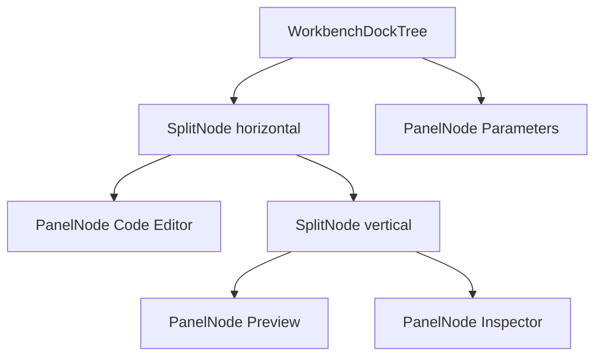
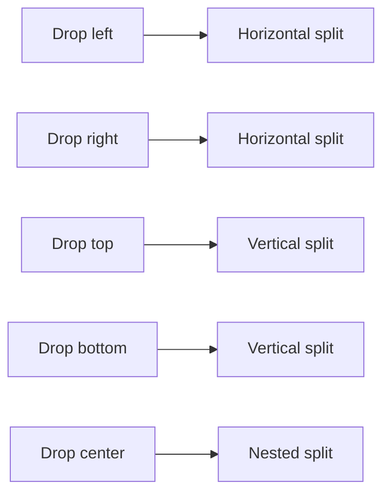
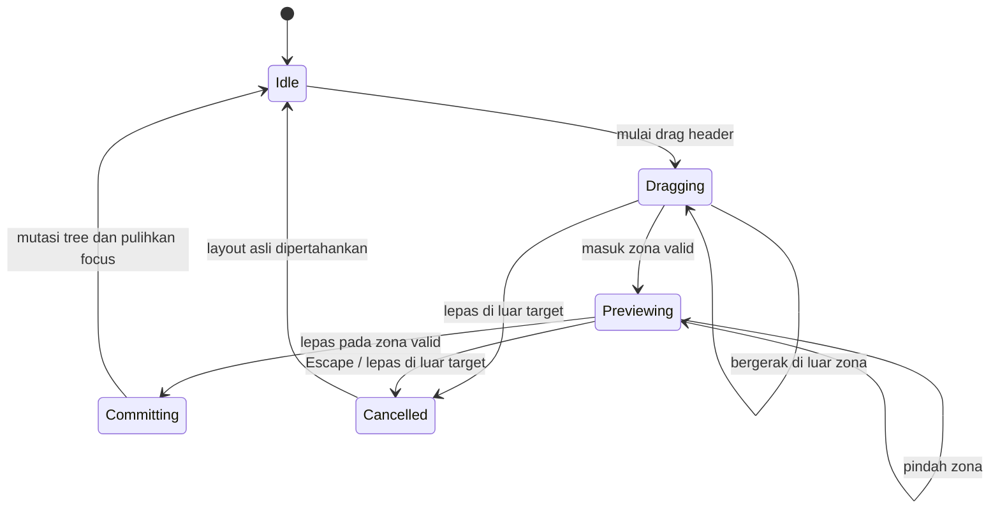
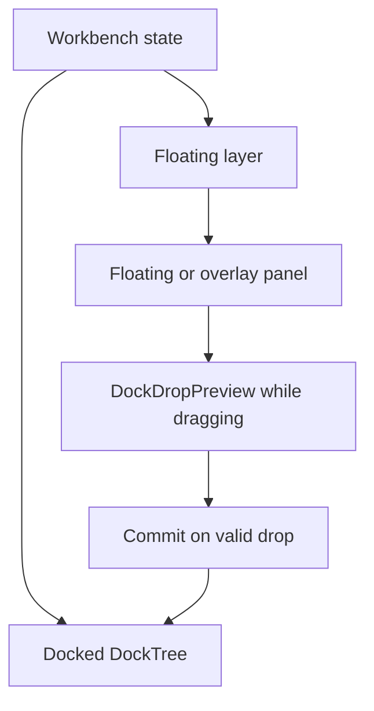

# Sub-Rencana 03 — Docking Tree, Split Layout, dan Drop Preview

**Status:** Tahap 0 dan Tahap 1 selesai; Tahap 2 sebagian selesai; Tahap 3 terintegrasi; Tahap 4 dan 5 sebagian selesai; Tahap 6–7 belum selesai
**Repository pemilik:** `relgeo/flutter`
**Pemilik keputusan:** Agus Made
**Compatibility line:** RelGeo DSL 0.5.x
**Prasyarat:** [Sub-Rencana 02](./02-workbench-layout-and-panel-system.md)

## 1. Latar belakang

Workbench saat ini sudah memiliki panel, placement, splitter, floating bounds,
overlay, profile, persistence, command registry, serta drag-to-dock berbasis
zona kasar. Namun model layout-nya masih berupa kumpulan placement dan rasio
region. Model tersebut belum cukup ekspresif untuk layout bertingkat seperti
IDE/CAD desktop.

Referensi utama adalah [gist contoh Dock layout](https://gist.github.com/sangdongvan/a3c7ecbc2063ddf42bd2260b6db4dcc9).
Gist tersebut menggunakan `Panel`, `HorizontalSplitter`, dan
`VerticalSplitter` secara rekursif. Setiap panel tetap surface mandiri dengan
header sendiri; panel tidak otomatis berubah menjadi tab.

Gist bukan dependency dan tidak disalin apa adanya. Kodenya masih berupa contoh
lama dan belum mencakup floating window, docking preview, persistence,
availability panel, accessibility, atau recovery layout. Yang diadopsi adalah
model mental dan aturan geometri layout-nya.

## 2. Keputusan arsitektur

### 2.1 Layout adalah pohon, bukan daftar placement

Workbench menggunakan immutable layout tree sebagai sumber kebenaran untuk
panel docked:



Kontrak konseptual:

```text
DockNode
  PanelNode(panelId)
  SplitNode(axis, children, ratios)

DockedLayout
  schemaVersion
  root: DockNode

FloatingPanelState
  panelId
  placement: floating | overlay
  bounds
  zOrder
  collapsed

WorkbenchDockState
  docked: DockedLayout
  floating: List<FloatingPanelState>
  activeProfileId
```

`PanelNode` berarti satu panel mandiri dengan header/title dan body sendiri.
RelGeo tidak memasukkan tab workspace ke dalam kontrak docking ini. Docking
empat panel utama selalu menghasilkan panel-panel mandiri dalam nested split.

### 2.2 Orientasi splitter

| Area drop | Node yang dibuat | Arah susunan anak |
| --- | --- | --- |
| kiri | `SplitNode(horizontal)` dengan target di kiri | kiri ke kanan |
| kanan | `SplitNode(horizontal)` dengan target di kanan | kiri ke kanan |
| atas | `SplitNode(vertical)` dengan target di atas | atas ke bawah |
| bawah | `SplitNode(vertical)` dengan target di bawah | atas ke bawah |
| tengah | split nested sesuai konteks target | kontekstual |

Horizontal berarti pembagian ruang kiri-kanan. Vertical berarti pembagian ruang
atas-bawah. Ini harus konsisten dengan splitter yang sudah ada agar arah drag
dan perubahan rasio tidak terbalik.



### 2.3 Panel mandiri tanpa tab workspace

Setiap panel memiliki caption/title, tombol collapse, placement action,
resize boundary, dan semantics sendiri. Tidak ada konsep tab workspace atau
perilaku yang menggabungkan beberapa panel menjadi satu tab container.

## 3. Drop preview dan gesture contract

Selama panel di-drag:

1. layout aktual tidak berubah;
2. pointer/touch dihitung terhadap kandidat target dock;
3. kandidat drop valid menampilkan hint visual;
4. hint menampilkan rectangle tujuan dan orientasi susunan;
5. layout baru dikomit hanya saat gesture dilepas;
6. gesture dibatalkan tanpa mutasi jika tidak ada zona valid.



### 3.1 Zona drop

Setiap target dapat menghasilkan zona `left`, `right`, `top`, `bottom`, dan
`center`. Center selalu menghasilkan nested split yang sesuai dengan konteks
target; ia tidak menjadi tab container.

```text
DockDropPreview
  sourcePanel
  targetNodePath
  zone: left | right | top | bottom | center
  rect
  orientation: horizontal | vertical | none
  insertionIndex
  isValid
```

Preview harus berupa overlay visual yang menunjukkan rectangle hasil, bukan
perubahan warna samar pada panel. Drop invalid harus dibedakan secara visual
atau tidak menampilkan preview.

Pure hit-testing awal sudah tersedia di
`lib/src/ui/docking/dock_drop_preview.dart`. Ia menemukan target nested
berdasarkan path, membedakan edge band 25% dari center, menghitung rectangle
hasil, dan menyatakan orientation tanpa memutasi layout. Validasi
minimum-size/availability dan commit/cancel gesture masih belum diintegrasikan
ke shell. `DockDropPreviewOverlay` sudah menyediakan visual rectangle yang
hanya tampil untuk preview valid, dengan label zona dan tanpa mengambil pointer
event.

### 3.2 Validasi drop

Drop ditolak jika source dan target sama tanpa operasi bermakna, panel tidak
tersedia, target locked, hasil melanggar minimum size, atau target overlay
memang tidak menerima dock. Drop invalid tidak boleh mengubah layout.

## 4. Transformasi tree

Operasi layout harus berupa transformasi murni yang dapat diuji tanpa Flutter
rendering:

```text
split(targetPath, newPanel, zone)
remove(panelId)
insert(panelId, targetPath, zone)
replace(panelId, replacementNode)
normalize(node)
validate(node, constraints)
```

```mermaid
flowchart LR
  before[Panel A] --> op[insert Panel B at right]
  op --> after[Horizontal split A | B]
  after --> op2[insert Panel C at bottom of B]
  op2 --> result[Horizontal split A | Vertical split B / C]
```

`normalize` menghapus split dengan satu child, menggabungkan split ber-axis
sama jika aman, mempertahankan panel yang tidak berubah, dan memastikan ratio
valid. Availability Parameters boleh menghilangkan leaf dari render tree,
tetapi tidak boleh menghapus preference yang dapat dipulihkan.

## 5. Hubungan dengan model yang sudah ada

Migrasi dilakukan bertahap, bukan rewrite mendadak:

| Model sekarang | Peran setelah migrasi |
| --- | --- |
| `WorkbenchPanelId` | identitas leaf `PanelNode` |
| `WorkbenchPanelVisibility` | compatibility/render state |
| `WorkbenchPanelPlacement` | compatibility projection dari tree/floating |
| `splitRatios` | digantikan rasio pada setiap `SplitNode` |
| `floatingBounds` | `FloatingPanelState.bounds` |
| `floatingOrder` | `FloatingPanelState.zOrder` |
| `WorkbenchLayoutController` | facade command dan owner mutation |
| `WorkbenchLayoutPersistence` | serializer state tree versioned |
| layout profiles | menghasilkan tree baseline |

Controller tetap mengekspos projection lama selama transisi agar menu, test,
dan host API tidak perlu berubah sekaligus. Persistence dinaikkan schema version
setelah tree dapat direstore dengan aman.

## 6. Floating, overlay, dan docking kembali



Aturan:

- drag header memindahkan panel tanpa mengubah dock tree;
- resize handle hanya mengubah floating bounds;
- preview muncul ketika header memasuki zona dock valid;
- drop valid menghapus panel dari floating layer dan memasukkan leaf ke tree;
- drop di luar zona valid hanya menyimpan posisi floating terakhir;
- collapse floating mempertahankan lebar dan posisi, tetapi tinggi menjadi tinggi
  header;
- docking memulihkan focus ke panel yang sama;
- Escape membatalkan sesi drag atau menutup overlay sesuai modalitas.

## 7. Persistence dan profile

Schema target menyimpan tree, bukan hanya placement global:

```json
{
  "schemaVersion": 2,
  "activeProfileId": "custom",
  "docked": {
    "type": "split",
    "axis": "horizontal",
    "ratios": [0.32, 0.68],
    "children": [
      { "type": "panel", "panelId": "editor" },
      {
        "type": "split",
        "axis": "vertical",
        "ratios": [0.72, 0.28],
        "children": [
          { "type": "panel", "panelId": "preview" },
          { "type": "panel", "panelId": "inspector" }
        ]
      }
    ]
  },
  "floating": [],
  "hidden": ["parameters"]
}
```

Migrasi: baca schema lama, bentuk tree Standard dari placement lama, migrasikan
floating panel, validasi, simpan schema baru hanya setelah restore berhasil,
dan fallback ke Standard jika parsing gagal. Built-in profiles menjadi tree
immutable; `Custom` adalah snapshot hasil edit manual. Tidak ada profile atau
persistence state untuk tab workspace.

## 8. Struktur kode yang disarankan

```text
lib/src/ui/docking/
  dock_node.dart
  dock_axis.dart
  dock_zone.dart
  dock_tree_operations.dart
  dock_tree_validator.dart
  dock_drop_preview.dart
  dock_drag_session.dart
  dock_layout_renderer.dart
  dock_layout_serializer.dart
  dock_layout_migration.dart
```

Model, transformasi, validator, drag session, preview, renderer, serializer,
dan migrator dipisahkan. Detail tree tidak ditanam di `CADWorkbenchPage`.

## 9. Tahapan implementasi

### Tahap 0 — Keputusan dan baseline

- [x] membaca gist sebagai referensi arsitektur;
- [x] menetapkan panel mandiri tanpa tab workspace;
- [x] menetapkan aturan orientasi horizontal/vertical;
- [x] menetapkan drop preview sebelum commit;
- [x] menambahkan test baseline untuk behavior docking saat ini.

### Tahap 1 — Pure docking tree model

- [x] buat `DockNode`, `PanelNode`, dan `SplitNode`;
- [x] buat equality, JSON serialization, dan schema version;
- [x] buat insert, remove, split, normalize, dan validate;
- [x] tolak duplicate panel dan ratio invalid;
- [x] tulis unit test tree tanpa Flutter rendering.

### Tahap 2 — Renderer dan splitter tree

- [~] render PanelNode melalui builder sebagai panel mandiri; header/title tetap
  menjadi tanggung jawab surface panel saat integrasi;
- [x] render SplitNode sebagai Row/Column sesuai axis;
- [x] gunakan splitter visual 1px dengan hit area terpisah;
- [~] terapkan min/max constraint dan arah resize konsisten; pure tree resize
  sudah meng-clamp minimum dan menjaga arah delta, tetapi belum terhubung ke
  `WorkbenchLayoutController` produksi;
- [ ] tambahkan golden untuk tree standard, nested, dan compact.

Renderer tree awal sudah tersedia di
`lib/src/ui/docking/dock_layout_renderer.dart`. Ia sengaja belum menggantikan
shell lama: tree dapat dirender secara rekursif, split horizontal menjadi Row,
split vertical menjadi Column, rasio menjadi flex, divider visual berukuran
1 px memiliki hit-area 9 px terpisah, dan callback resize membawa path split
serta index divider. `DockLayoutAdapter` memproyeksikan placement model lama ke
tree untuk masa transisi. Integrasi ke controller/shell produksi, header panel,
golden, dan drop-preview tetap ditahan sampai kontrak tree lengkap.

### Tahap 3 — Drop target dan preview

- [x] buat hit testing zona kiri/kanan/atas/bawah/tengah;
- [x] buat preview rectangle dan orientation yang jelas;
- [x] tampilkan preview hanya untuk drop valid;
- [ ] commit transformasi hanya saat drag end;
- [ ] dukung Escape, cancel, dan outside drop;
- [ ] uji pointer, touch, dan keyboard Escape.

### Tahap 4 — Integrasi panel RelGeo

- [x] migrasikan Editor, Preview, Inspector, dan Parameters ke tree;
- [ ] pertahankan Parameters sebagai panel mandiri bersyarat;
- [ ] pertahankan View → Panels dan checkmark;
- [ ] pertahankan collapse, float, overlay, dan focus restoration;
- [ ] tambahkan compatibility projection untuk API lama.

### Tahap 5 — Floating dan docking kembali

- [x] hubungkan floating/overlay dengan drag session;
- [x] tampilkan preview saat floating panel mendekati dock area;
- [x] dukung drop ke nested target, bukan hanya region global;
- [x] dukung resize dan move floating tanpa mengubah dock tree;
- [ ] clamp bounds dan pulihkan z-order/focus.

### Tahap 6 — Profiles, persistence, dan migration

- [ ] ubah built-in profiles menjadi tree baseline;
- [ ] migrasikan schema layout lama ke schema tree baru;
- [ ] simpan tree, floating state, z-order, dan collapsed state dengan debounce;
- [ ] fallback corruption/unknown version ke Standard;
- [ ] uji restart dan round-trip pada native macOS.

### Tahap 7 — Command, accessibility, dan quality gate

- [ ] pastikan menu, toolbar, context menu, dan shortcut memakai registry;
- [ ] expose semantics untuk panel, splitter, preview, dan floating handle;
- [ ] pastikan focus tidak hilang setelah docking;
- [ ] jalankan analyzer, seluruh test, golden, web build, dan macOS arm64;
- [ ] verifikasi manual pointer drag/resize pada macOS;
- [ ] dokumentasikan validasi Ubuntu dan Windows saat host tersedia.

## 10. Acceptance criteria

- [ ] empat panel dapat disusun dalam nested row/column sebagai panel mandiri;
- [ ] arah drop kiri/kanan/atas/bawah konsisten dan dapat diprediksi;
- [ ] preview zona drop terlihat sebelum panel dilepas;
- [ ] drop invalid tidak mengubah layout;
- [ ] panel dapat dipindahkan dari floating ke nested dock target;
- [ ] floating panel dapat dipindahkan, di-resize, dan di-collapse;
- [ ] Parameters tidak tampil jika dokumen tidak memiliki parameter;
- [ ] layout tree dapat dipersist dan direstore setelah restart;
- [ ] schema lama dapat dimigrasikan atau fallback dengan aman;
- [ ] preset menghasilkan tree deterministik;
- [ ] command/context menu sinkron dengan state tree;
- [ ] pure model, widget, golden, dan native smoke test tersedia;
- [ ] tidak ada regression terhadap editor, preview, inspector, export SVG,
  theme, canvas appearance, atau lifecycle dokumen.

## 11. Risiko dan keputusan yang ditunda

| Risiko/keputusan | Rekomendasi |
| --- | --- |
| Kompleksitas tree | Batasi kontrak pada PanelNode dan SplitNode |
| Package docking eksternal | Jangan tambah dependency sebelum kontrak internal stabil |
| Drop center | Selalu nested placement; tidak ada tab workspace |
| Panel wajib | Validator mencegah tree kosong dan menjaga panel wajib |
| Layout kecil | Terapkan min-size, collapse, lalu compact/scroll fallback |
| Persistence lama | Migrasi sekali ke schema tree, bukan dua sumber kebenaran |
| Accessibility | Sediakan semantics sejak renderer pertama |
| Platform window | Bedakan dock tree internal dari native OS window |

## 12. Definition of done

Sub-plan selesai jika workbench memiliki model tree yang menjelaskan nested
row/column, panel mandiri, floating state, dan drop preview; pengguna melihat
hasil docking sebelum melepas panel; operasi valid persisten; operasi invalid
aman dibatalkan; dan behavior utama diuji melalui pure, widget/golden, serta
native smoke test.

## 13. Decision log

| Tanggal | Keputusan |
| --- | --- |
| 2026-09-28 | Gist recursive splitter diterima sebagai referensi konsep, bukan dependency atau kode yang disalin. |
| 2026-09-28 | RelGeo menggunakan PanelNode dan SplitNode sebagai fondasi docking. Tab workspace sengaja tidak menjadi bagian dari kontrak atau backlog. |
| 2026-09-28 | Drag-to-dock wajib memakai preview rectangle/zona sebelum commit. Drop di luar zona valid tidak mengubah dock tree. |
| 2026-09-28 | Kiri/kanan menghasilkan susunan horizontal; atas/bawah menghasilkan susunan vertical; center selalu menghasilkan nested layout tanpa tab workspace. |
| 2026-09-28 | Tahap 0–1 selesai — pure docking tree | Menambahkan `DockPanelNode`, `DockSplitNode`, `DockedLayout`, codec JSON versioned, serta transformasi pure untuk insert/remove/normalize/validate. Unit test mengunci nested layout, orientasi kiri/kanan/atas/bawah, duplicate rejection, missing target, ratio normalization, dan round-trip serialization. Renderer Flutter dan drop-preview visual belum disentuh. |
| 2026-09-28 | Renderer tree scaffold | Menambahkan `DockLayoutRenderer` dan widget test untuk split horizontal, nested vertical split, panel mandiri, serta custom divider builder. Renderer belum diintegrasikan ke shell utama dan belum mengklaim hit-area resize, drop preview, atau persistence tree. Full gate setelah perubahan: analyzer bersih, 241 test lulus, web build berhasil, dan macOS debug arm64 berhasil. |
| 2026-09-29 | Tahap 1/2 — Resize contract dan placement adapter | Menambahkan `DockTreeOperations.resize` untuk perubahan ratio murni berbasis split path dengan minimum clamp dan arah delta konsisten. Menambahkan `DockLayoutAdapter` untuk memproyeksikan placement lama menjadi nested horizontal/vertical tree tanpa menghapus preference hidden/floating. Renderer kini menyediakan garis 1 px, hit-area terpisah 9 px, semantics resize, dan callback divider. Targeted docking tests serta analyzer lulus; integrasi shell/controller, drop preview, golden, dan persistence tree masih terbuka. |
| 2026-09-29 | Quality gate resize/adapter | `flutter analyze` lulus, seluruh 246 test lulus, `flutter build web --no-pub` berhasil, dan `git diff --check` bersih setelah penambahan resize contract, adapter, dan hit-area divider. |
| 2026-09-29 | Tahap 3 — Pure drop-preview geometry | Menambahkan `DockDropPreviewCalculator` untuk hit-testing target nested, zona edge/center, rectangle preview, orientation, dan invalid self/outside drop tanpa mutasi tree. Targeted tests dan analyzer lulus; overlay visual, availability/min-size validation, serta commit/cancel gesture belum terhubung ke shell. |
| 2026-09-29 | Quality gate drop-preview geometry | `flutter analyze` lulus, seluruh 249 test lulus, `flutter build web --no-pub` berhasil, dan `git diff --check` bersih setelah penambahan pure drop-preview calculator. |
| 2026-09-29 | Tahap 3 — Preview overlay scaffold | Menambahkan `DockDropPreviewOverlay` yang menampilkan rectangle hasil, label zona, dan tidak menerima pointer event. Preview null/invalid tidak dirender. Widget test dan analyzer lulus; overlay belum dipasang ke drag session shell. |
| 2026-09-29 | Quality gate preview overlay | `flutter analyze` lulus, seluruh 251 test lulus, `flutter build web --no-pub` berhasil, dan `git diff --check` bersih setelah penambahan overlay valid-only. |
| 2026-09-29 | Tahap 3/5 — Shell drag-preview integration | Floating layer dipindahkan ke atas seluruh workbench termasuk Parameters; resize divider horizontal tidak lagi menghitung panel bawah sebagai panel samping; drag handle floating menghitung target dari adapter, menampilkan `DockDropPreviewOverlay` saat gesture melewati touch-slop, dan menghapus preview saat drop/cancel. Drop memakai zona preview sebagai compatibility bridge ke placement lama; nested dock tree belum menjadi sumber kebenaran. Regression shell dan analyzer lulus. |
| 2026-09-29 | Tahap 4/5 — Recursive tree activation | Drop valid kini menjalankan `DockTreeOperations.insert`, mengaktifkan `DockLayoutRenderer` untuk nested Row/Column, dan mengarahkan resize divider ke `DockTreeOperations.resize`. Floating panel tetap dikelola di layer terluar, sedangkan panel hidden/Parameters unavailable diproyeksikan keluar dari tree saat render. Placement lama tetap dipakai sebelum operasi docking pertama dan untuk compatibility commands. Persistence tree, profile migration, serta re-dock menu penuh belum selesai. |
| 2026-09-29 | Quality gate recursive tree activation | `flutter analyze` lulus, seluruh 253 test lulus, `flutter build web --no-pub` berhasil, dan `git diff --check` bersih. |
