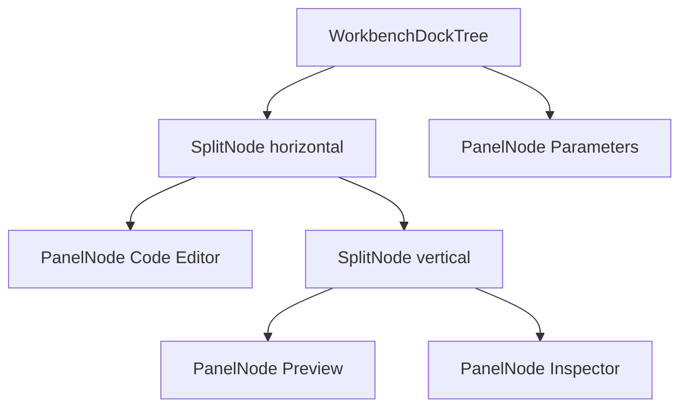
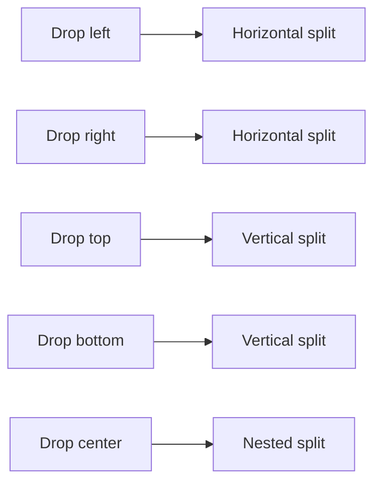
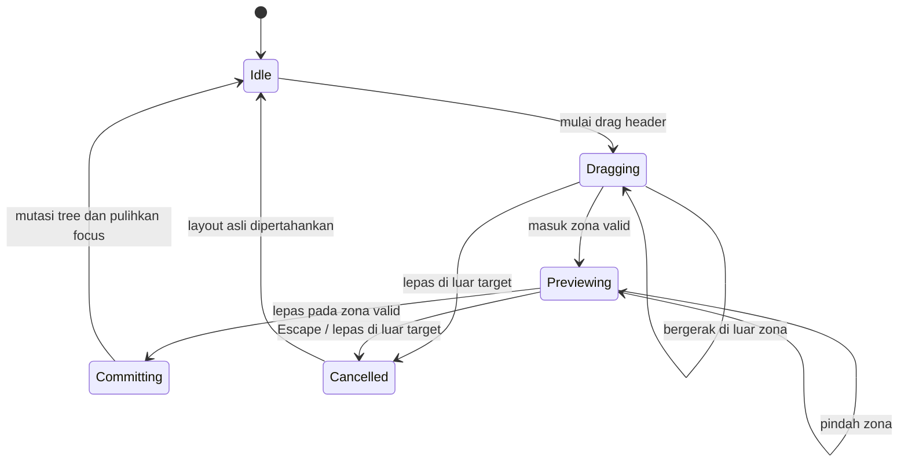
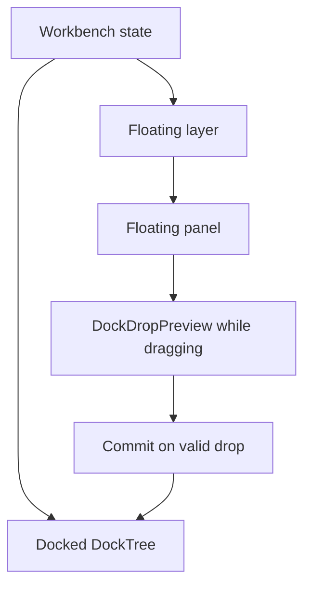

# Sub-Rencana 03 — Docking Tree, Split Layout, dan Drop Preview

**Status:** Tahap 0–1 selesai; Tahap 2 sebagian besar teruji; Tahap 3–5 terintegrasi untuk alur utama; Tahap 6 profile/reset dan persistence otomatis selesai; gate otomatis Debug dan Release universal terbaru lulus; smoke interaction/restart native serta validasi Ubuntu/Windows masih terbuka
**Repository pemilik:** `relgeo/flutter`
**Pemilik keputusan:** Agus Made
**Compatibility line:** RelGeo DSL 0.5.x
**Prasyarat:** [Sub-Rencana 02](./02-workbench-layout-and-panel-system.md)

> **Pembaruan — 2026-10-07:** Untuk panel shell, model aktif telah menghapus mode `Overlay` dan visibility `collapsed`; migrasi legacy `overlay → floating` dan `collapsed → hidden` dicakup regression test. Floating panel memakai elevasi 16, tidak ditutup Escape, dapat di-resize, dan title bar panel fitur kini menjadi drag region penuh (tombol tetap interaktif); drag title bar diuji bersama preview/drop. Profile/reset kini memakai recursive tree; projection mempertahankan bobot fallback layout lama (`1/3`) dan regression golden mencakup kelima preset. Seluruh **300 test** dan analyzer lulus. Build web lulus. Wrapper Flutter macOS meminta destination `arm64` yang tidak tersedia, tetapi direct Xcode workspace Debug berhasil pada destination `x86_64` dan binary diverifikasi; build Release universal berhasil pada checkpoint sebelumnya. Compact splitter/scroll, invalid drop, dan native pointer resize splitter Preview/Inspector serta Parameters telah diverifikasi; posisi dikembalikan dan tree tidak diubah. Floating move/drop/resize native, restart setelah operasi tree, dan host Ubuntu/Windows belum dilakukan.

## 1. Latar belakang

Workbench saat ini sudah memiliki panel, placement, splitter, floating bounds,
profile, persistence, command registry, serta drag-to-dock berbasis
zona kasar. Namun model layout-nya masih berupa kumpulan placement dan rasio
region. Model tersebut belum cukup ekspresif untuk layout bertingkat seperti
IDE/CAD desktop.

Referensi utama adalah [gist contoh Dock layout](https://gist.github.com/sangdongvan/a3c7ecbc2063ddf42bd2260b6db4dcc9).
Gist tersebut menggunakan `Panel`, `HorizontalSplitter`, dan
`VerticalSplitter` secara rekursif. Setiap panel tetap surface mandiri dengan
header sendiri; panel tidak otomatis berubah menjadi tab.

Gist bukan dependency dan tidak disalin apa adanya. Kodenya masih berupa contoh
lama dan belum mencakup floating window, docking preview, persistence,
availability panel, accessibility, atau recovery layout. Yang diadopsi adalah
model mental dan aturan geometri layout-nya.

## 2. Keputusan arsitektur

### 2.1 Layout adalah pohon, bukan daftar placement

Workbench menggunakan immutable layout tree sebagai sumber kebenaran untuk
panel docked:



Kontrak konseptual:

```text
DockNode
  PanelNode(panelId)
  SplitNode(axis, children, ratios)

DockedLayout
  schemaVersion
  root: DockNode

FloatingPanelState
  panelId
  placement: floating
  bounds
  zOrder

WorkbenchDockState
  docked: DockedLayout
  floating: List<FloatingPanelState>
  activeProfileId
```

`PanelNode` berarti satu panel mandiri dengan header/title dan body sendiri.
RelGeo tidak memasukkan tab workspace ke dalam kontrak docking ini. Docking
empat panel utama selalu menghasilkan panel-panel mandiri dalam nested split.

### 2.2 Orientasi splitter

| Area drop | Node yang dibuat | Arah susunan anak |
| --- | --- | --- |
| kiri | `SplitNode(horizontal)` dengan target di kiri | kiri ke kanan |
| kanan | `SplitNode(horizontal)` dengan target di kanan | kiri ke kanan |
| atas | `SplitNode(vertical)` dengan target di atas | atas ke bawah |
| bawah | `SplitNode(vertical)` dengan target di bawah | atas ke bawah |
| tengah | split nested sesuai konteks target | kontekstual |

Horizontal berarti pembagian ruang kiri-kanan. Vertical berarti pembagian ruang
atas-bawah. Ini harus konsisten dengan splitter yang sudah ada agar arah drag
dan perubahan rasio tidak terbalik.



### 2.3 Panel mandiri tanpa tab workspace

Setiap panel memiliki caption/title, tombol `Close`, placement action yang
sesuai state, resize boundary, dan semantics sendiri. Tidak ada konsep tab
workspace atau perilaku yang menggabungkan beberapa panel menjadi satu tab
container. Visibility hanya `visible` atau `hidden`; menyembunyikan panel tidak
mengubah tree/floating placement, bounds, atau z-order.

Saat docked, title bar menyediakan `Float` dan `Close`. Saat floating, tombol
`Float` tidak ditampilkan; tombol `Close` dan aksi khusus panel tetap tersedia.
Seluruh title bar floating selain tombol/kontrol interaktif adalah drag hit
area, sehingga tidak diperlukan drag handle/button terpisah. Hit testing harus
mencegah aksi kontrol memulai drag.

## 3. Drop preview dan gesture contract

Selama panel di-drag:

1. layout aktual tidak berubah;
2. pointer/touch dihitung terhadap kandidat target dock;
3. kandidat drop valid menampilkan hint visual;
4. hint menampilkan rectangle tujuan dan orientasi susunan;
5. layout baru dikomit hanya saat gesture dilepas;
6. gesture dibatalkan tanpa mutasi jika tidak ada zona valid.



### 3.1 Zona drop

Setiap target dapat menghasilkan zona `left`, `right`, `top`, `bottom`, dan
`center`. Center selalu menghasilkan nested split yang sesuai dengan konteks
target; ia tidak menjadi tab container.

```text
DockDropPreview
  sourcePanel
  targetNodePath
  zone: left | right | top | bottom | center
  rect
  orientation: horizontal | vertical | none
  insertionIndex
  isValid
```

Preview harus berupa overlay visual yang menunjukkan rectangle hasil, bukan
perubahan warna samar pada panel. Drop invalid harus dibedakan secara visual
atau tidak menampilkan preview.

Pure hit-testing tersedia di `lib/src/ui/docking/dock_drop_preview.dart`. Ia
menemukan target nested berdasarkan path, membedakan edge band 25% dari center,
menghitung rectangle hasil, dan menyatakan orientation tanpa memutasi layout.
`DockDropPreviewOverlay` sudah terintegrasi ke shell dan hanya tampil untuk
preview valid, dengan label zona serta tanpa mengambil pointer event. Commit
hanya terjadi untuk preview valid; pelepasan di luar zona mempertahankan panel
sebagai floating. Validasi minimum-size kini diterapkan pada hasil split
berdasarkan minimum panel source dan target. Model/UX saat ini tidak memiliki
state panel locked, dan tidak ada operasi produk yang memerlukan panel locked;
kontrak itu tidak ditambahkan sebagai abstraksi spekulatif. Panel unavailable
dikeluarkan dari tree aktif sebelum hit-testing, sedangkan calculator menolak
target yang tidak ada pada tree. Test calculator dan shell mengunci kedua aturan
ini.

### 3.2 Validasi drop

Drop ditolak jika source dan target sama tanpa operasi bermakna, panel tidak
tersedia pada tree aktif, atau hasil melanggar minimum size. Tidak ada aturan
target locked sampai konsep locked diperkenalkan oleh kebutuhan produk. Drop
invalid tidak boleh mengubah layout.

## 4. Transformasi tree

Operasi layout harus berupa transformasi murni yang dapat diuji tanpa Flutter
rendering:

```text
split(targetPath, newPanel, zone)
remove(panelId)
insert(panelId, targetPath, zone)
replace(panelId, replacementNode)
normalize(node)
validate(node, constraints)
```

```mermaid
flowchart LR
  before[Panel A] --> op[insert Panel B at right]
  op --> after[Horizontal split A | B]
  after --> op2[insert Panel C at bottom of B]
  op2 --> result[Horizontal split A | Vertical split B / C]
```

`normalize` menghapus split dengan satu child, menggabungkan split ber-axis
sama jika aman, mempertahankan panel yang tidak berubah, dan memastikan ratio
valid. Availability Parameters boleh menghilangkan leaf dari render tree,
tetapi tidak boleh menghapus preference yang dapat dipulihkan.

## 5. Hubungan dengan model yang sudah ada

Migrasi dilakukan bertahap, bukan rewrite mendadak:

| Model sekarang | Peran setelah migrasi |
| --- | --- |
| `WorkbenchPanelId` | identitas leaf `PanelNode` |
| `WorkbenchPanelVisibility` | compatibility/render state |
| `WorkbenchPanelPlacement` | compatibility projection dari tree/floating |
| `splitRatios` | digantikan rasio pada setiap `SplitNode` |
| `floatingBounds` | `FloatingPanelState.bounds` |
| `floatingOrder` | `FloatingPanelState.zOrder` |
| `WorkbenchLayoutController` | facade command dan owner mutation |
| `WorkbenchLayoutPersistence` | serializer state tree versioned |
| layout profiles | menghasilkan tree baseline |

Controller tetap mengekspos projection lama selama transisi agar menu, test,
dan host API tidak perlu berubah sekaligus. Snapshot persistence sekarang
membungkus layout lama dan tree dock dalam schema v2, membaca payload schema v1,
serta merestore tree setelah reload. Saat tree aktif, perintah placement panel
kini memindahkan atau menyisipkan panel ke tree relatif terhadap panel jangkar
yang sesuai (editor/preview/inspector/parameters) alih-alih membuang tree.
Built-in profile dan reset juga menerapkan recursive tree; projection
compatibility tetap dipertahankan untuk command API dan storage migration.

## 6. Floating dan docking kembali



Aturan:

- drag header memindahkan panel tanpa mengubah dock tree;
- seluruh title bar floating kecuali kontrol interaktif memulai drag;
- `Close` menyembunyikan panel tanpa membuang placement, bounds, atau z-order;
- `View → Panels` menampilkan kembali panel pada placement terakhir;
- resize handle hanya mengubah floating bounds;
- preview muncul ketika header memasuki zona dock valid;
- drop valid menghapus panel dari floating layer dan memasukkan leaf ke tree;
- drop di luar zona valid hanya menyimpan posisi floating terakhir;
- docking memulihkan focus ke panel yang sama;
- Escape saat drag aktif membatalkan sesi drag dan memulihkan posisi/z-order;
  Escape tidak menutup atau menyembunyikan floating panel.
- floating panel memakai elevasi visual tinggi yang konsisten di atas panel
  docked.

## 7. Persistence dan profile

Schema target menyimpan tree, bukan hanya placement global:

```json
{
  "schemaVersion": 2,
  "activeProfileId": "custom",
  "docked": {
    "type": "split",
    "axis": "horizontal",
    "ratios": [0.32, 0.68],
    "children": [
      { "type": "panel", "panelId": "editor" },
      {
        "type": "split",
        "axis": "vertical",
        "ratios": [0.72, 0.28],
        "children": [
          { "type": "panel", "panelId": "preview" },
          { "type": "panel", "panelId": "inspector" }
        ]
      }
    ]
  },
  "floating": [],
  "hidden": ["parameters"]
}
```

Migrasi: baca schema lama, bentuk tree Standard dari placement lama saat
diperlukan, migrasikan floating panel, validasi, simpan schema baru setelah
restore berhasil, dan fallback ke Standard jika parsing gagal. Implementasi
saat ini menyimpan tree aktif dengan debounce, memvalidasi tree saat dibaca,
mempertahankan payload schema v1, serta menerapkan profile/reset melalui tree
recursive. Projection profile memakai bobot fallback yang sama dengan renderer
placement lama agar preset tidak mengalami perubahan proporsi yang tidak
diinginkan. Tidak ada profile atau persistence state untuk tab workspace.

## 8. Struktur kode yang disarankan

```text
lib/src/ui/docking/
  dock_node.dart
  dock_axis.dart
  dock_zone.dart
  dock_tree_operations.dart
  dock_tree_validator.dart
  dock_drop_preview.dart
  dock_drag_session.dart
  dock_layout_renderer.dart
  dock_layout_serializer.dart
  dock_layout_migration.dart
```

Model, transformasi, validator, drag session, preview, renderer, serializer,
dan migrator dipisahkan. Detail tree tidak ditanam di `CADWorkbenchPage`.

## 9. Tahapan implementasi

### Tahap 0 — Keputusan dan baseline

- [x] membaca gist sebagai referensi arsitektur;
- [x] menetapkan panel mandiri tanpa tab workspace;
- [x] menetapkan aturan orientasi horizontal/vertical;
- [x] menetapkan drop preview sebelum commit;
- [x] menambahkan test baseline untuk behavior docking saat ini.

### Tahap 1 — Pure docking tree model

- [x] buat `DockNode`, `PanelNode`, dan `SplitNode`;
- [x] buat equality, JSON serialization, dan schema version;
- [x] buat insert, remove, split, normalize, dan validate;
- [x] tolak duplicate panel dan ratio invalid;
- [x] tulis unit test tree tanpa Flutter rendering.

### Tahap 2 — Renderer dan splitter tree

- [x] render PanelNode melalui builder sebagai panel mandiri; header/title tetap
  menjadi tanggung jawab surface panel;
- [x] render SplitNode sebagai Row/Column sesuai axis;
- [x] gunakan splitter visual 1px dengan hit area terpisah;
- [x] terapkan min/max constraint dan arah resize konsisten; min/max per
  feature dihitung pada dua subtree divider, termasuk komposisi nested split.
  Jika ukuran canvas tidak dapat memenuhi rentang kedua sisi, resize
  mempertahankan rasio;
- [x] tambahkan golden renderer untuk tree standard, nested, dan compact
  (compact menggunakan tree vertikal pada viewport sempit).

Renderer tree sudah tersedia di `lib/src/ui/docking/dock_layout_renderer.dart`
dan aktif untuk tree hasil drop yang valid. Split horizontal menjadi Row, split
vertical menjadi Column, rasio menjadi flex, divider visual berukuran 1 px
memiliki hit-area 9 px terpisah, dan callback resize membawa path split serta
index divider. `DockLayoutAdapter` memproyeksikan placement model lama selama
transisi; profile bawaan kini juga mengekspos proyeksi tree deterministik,
tetapi tetap memakai renderer compatibility sampai constraint compact tree
setara. Golden renderer mengunci tree standard, nested, dan vertical compact;
validasi interaksi splitter dan scrolling pada shell compact masih terpisah.

### Tahap 3 — Drop target dan preview

- [x] buat hit testing zona kiri/kanan/atas/bawah/tengah;
- [x] buat preview rectangle dan orientation yang jelas;
- [x] tampilkan preview hanya untuk drop valid;
- [x] commit transformasi hanya saat drag end;
- [x] dukung cancel dan outside drop tanpa mutasi;
- [x] dukung Escape untuk membatalkan drag floating dan mengembalikan posisi/z-order;
- [~] widget test pointer sintetis memverifikasi preview terlihat pada zona
  split yang memenuhi minimum-size; rollback Escape memiliki regression test
  pada drag floating. Gesture touch dan pointer/touch native manual masih
  terbuka.

### Tahap 4 — Integrasi panel RelGeo

- [x] migrasikan Editor, Preview, Inspector, dan Parameters ke tree;
- [x] pertahankan Parameters sebagai panel mandiri bersyarat dan uji agar
  rendering tree tidak menggandakan slot bawah;
- [x] pertahankan View → Panels dan checkmark;
- [x] pertahankan float dan focus restoration;
- [x] hapus mode panel `Overlay`; satu-satunya mode mengambang adalah `Floating`;
- [x] gunakan elevasi tinggi untuk semua floating panel dan jangan menutupnya
  saat Escape kecuali Escape membatalkan drag aktif;
- [x] sederhanakan lifecycle menjadi visible/hidden; `Close` menyembunyikan,
  `View → Panels` memulihkan placement dan geometri terakhir;
- [x] gunakan seluruh title bar floating (kecuali tombol/kontrol) sebagai drag
  hit area tanpa drag button khusus; docked header menampilkan `Float`, header
  floating tidak;
- [x] tambahkan compatibility projection untuk API lama.

### Tahap 5 — Floating dan docking kembali

- [x] hubungkan floating panel dengan drag session;
- [x] tampilkan preview saat floating panel mendekati dock area;
- [x] dukung drop ke nested target, bukan hanya region global;
- [x] dukung resize dan move floating tanpa mengubah dock tree;
- [x] clamp bounds dan pulihkan z-order/focus.

### Tahap 6 — Profiles, persistence, dan migration

- [x] built-in profiles mengekspos baseline tree deterministik dan profile/reset
  menerapkannya sebagai layout recursive aktif; bobot fallback kompatibel dan
  setiap preset dilindungi golden serta test render-once/visibility;
- [x] migrasikan schema layout lama ke schema tree baru;
- [x] simpan tree, floating state, z-order, dan visibility dengan debounce;
- [x] saat restore, petakan legacy visibility `collapsed` menjadi `hidden`
  tanpa mengubah floating/docked placement, bounds, atau z-order;
- [x] fallback corruption/unknown version ke Standard;
- [ ] uji restart dan round-trip pada native macOS.

### Tahap 7 — Command, accessibility, dan quality gate

- [x] command menu, toolbar, context menu, dan shortcut memakai registry yang
  sama; kontrol toolbar yang mengubah state lokal (mis. pemilih sheet) tetap
  memakai callback state pemiliknya;
- [x] expose semantics untuk panel, splitter tree/compatibility, preview drop,
  dan floating handle; splitters tree dapat dinaikkan/diturunkan lewat
  semantic actions dan preview drop diumumkan sebagai live region;
- [x] widget regression memastikan focus kembali ke panel setelah docking;
- [x] analyzer, seluruh test/golden, web build, macOS Debug arm64, dan macOS
  Release universal terbaru lulus; executable dan `App.framework` diverifikasi
  memuat `arm64` serta `x86_64`;
- [ ] verifikasi manual pointer drag/resize pada macOS;
- [~] jalankan native build/test Ubuntu dan Windows melalui workflow CI yang
  telah ditambahkan; hasilnya menunggu workflow dipush dan dijalankan. Smoke UX
  manual tetap memerlukan host masing-masing;

## 10. Acceptance criteria

- [x] empat panel dapat disusun dalam nested row/column sebagai panel mandiri;
- [x] arah drop kiri/kanan/atas/bawah konsisten dan dapat diprediksi;
- [x] preview zona drop terlihat sebelum panel dilepas;
- [x] drop invalid tidak mengubah layout;
- [x] panel dapat dipindahkan dari floating ke nested dock target;
- [x] floating panel dapat dipindahkan, di-resize, ditutup/disembunyikan, dan
  ditampilkan kembali pada bounds/placement terakhir;
- [x] title bar floating dapat digunakan untuk drag tanpa mengganggu tombol;
- [x] `Esc` tidak menutup floating panel; Escape hanya membatalkan sesi drag;
- [x] floating panel tampil di atas panel docked dengan elevasi visual tinggi;
- [x] state legacy `collapsed` dipulihkan sebagai `hidden`, lalu tersimpan
  kembali dengan schema visibility dua status;
- [x] Parameters tidak tampil jika dokumen tidak memiliki parameter;
- [x] layout tree dapat dipersist dan direstore setelah restart;
- [x] schema lama dapat dimigrasikan atau fallback dengan aman;
- [x] setiap preset menghasilkan tree deterministik, valid, dan tidak
  menggandakan panel;
- [x] command/context menu sinkron dengan state tree;
- [x] pure model, widget, dan golden regression test tersedia untuk tree,
  resize bounds, drop preview, serta layout standard/nested/compact;
- [ ] native smoke test manual tersedia dan dijalankan untuk pointer/touch/
  keyboard; automated/widget coverage tidak menggantikan verifikasi native;
- [x] tidak ada regression yang terdeteksi pada editor, preview, inspector,
  export SVG, theme, canvas appearance, atau lifecycle dokumen melalui full
  suite dan build web/macOS Debug.

### Sisa pekerjaan yang diketahui

- [x] Aktifkan profile/reset pada recursive tree setelah memperbaiki fallback
  rasio placement dan membatasi toolbar Preview agar chips wrap/scroll tanpa
  overflow. Golden kelima profile diperiksa/diperbarui; controller, tree, dan
  visibility regression mencakup penerapannya.
- [x] Uji splitter tree dan scrolling horizontal secara interaktif pada shell
  compact lewat widget gestures.
- [x] Kebijakan locked tidak diperlukan karena panel tidak memiliki state
  locked; panel unavailable dihilangkan dari active tree, target yang tak ada
  ditolak calculator, dan shell test membuktikan drop undersized tidak
  mengubah tree atau placement panel.
- [x] Build macOS Release terbaru menghasilkan app universal; `file` dan
  `lipo -info` mengonfirmasi executable serta Flutter `App.framework` memuat
  `arm64` dan `x86_64`.
- [ ] Jalankan native smoke test macOS untuk pointer drag/resize, keyboard,
  docking, focus, dan restart/restore setelah perubahan tree. Accessibility
  automation pada percobaan terbaru timeout saat mengikat ke window Release.
- [~] Build/test Ubuntu dan Windows 11 sudah dimasukkan ke native-runner CI;
  tunggu workflow dipush dan berhasil. Interaksi native manual pada OS tersebut
  tetap memerlukan host masing-masing.

Build/test Linux dan Windows akan dicakup oleh native-runner CI yang baru
ditambahkan (`.github/workflows/flutter-ci.yml`), setelah workflow dipush dan
berjalan. Ini menutup bukti compile/test runner, bukan pengganti UX smoke manual
atau aksesibilitas assistive technology pada desktop pengguna.

Placement commands dan profile/reset saat tree aktif mempertahankan nested
layout. Widget-level regression sudah lengkap untuk compact splitter/scroll dan
drop invalid; interaksi native, persistence restart, dan host desktop tambahan
tetap menjadi pekerjaan tersisa.

## 11. Risiko dan keputusan yang ditunda

| Risiko/keputusan | Rekomendasi |
| --- | --- |
| Kompleksitas tree | Batasi kontrak pada PanelNode dan SplitNode |
| Package docking eksternal | Jangan tambah dependency sebelum kontrak internal stabil |
| Drop center | Selalu nested placement; tidak ada tab workspace |
| Panel wajib | Validator mencegah tree kosong dan menjaga panel wajib |
| Layout kecil | Terapkan min-size, lalu compact/scroll fallback; panel dapat disembunyikan |
| Persistence lama | Migrasi sekali ke schema tree, bukan dua sumber kebenaran |
| Accessibility | Sediakan semantics sejak renderer pertama |
| Platform window | Bedakan dock tree internal dari native OS window |

## 12. Definition of done

Sub-plan selesai jika workbench memiliki model tree yang menjelaskan nested
row/column, panel mandiri, floating state, dan drop preview; pengguna melihat
hasil docking sebelum melepas panel; operasi valid persisten; operasi invalid
aman dibatalkan; dan behavior utama diuji melalui pure, widget/golden, serta
native smoke test.

## 13. Decision log

| Tanggal | Keputusan |
| --- | --- |
| 2026-09-28 | Gist recursive splitter diterima sebagai referensi konsep, bukan dependency atau kode yang disalin. |
| 2026-09-28 | RelGeo menggunakan PanelNode dan SplitNode sebagai fondasi docking. Tab workspace sengaja tidak menjadi bagian dari kontrak atau backlog. |
| 2026-09-28 | Drag-to-dock wajib memakai preview rectangle/zona sebelum commit. Drop di luar zona valid tidak mengubah dock tree. |
| 2026-09-28 | Kiri/kanan menghasilkan susunan horizontal; atas/bawah menghasilkan susunan vertical; center selalu menghasilkan nested layout tanpa tab workspace. |
| 2026-09-28 | Tahap 0–1 selesai — pure docking tree | Menambahkan `DockPanelNode`, `DockSplitNode`, `DockedLayout`, codec JSON versioned, serta transformasi pure untuk insert/remove/normalize/validate. Unit test mengunci nested layout, orientasi kiri/kanan/atas/bawah, duplicate rejection, missing target, ratio normalization, dan round-trip serialization. Renderer Flutter dan drop-preview visual belum disentuh. |
| 2026-09-28 | Renderer tree scaffold | Menambahkan `DockLayoutRenderer` dan widget test untuk split horizontal, nested vertical split, panel mandiri, serta custom divider builder. Renderer belum diintegrasikan ke shell utama dan belum mengklaim hit-area resize, drop preview, atau persistence tree. Full gate setelah perubahan: analyzer bersih, 241 test lulus, web build berhasil, dan macOS debug arm64 berhasil. |
| 2026-09-29 | Tahap 1/2 — Resize contract dan placement adapter | Menambahkan `DockTreeOperations.resize` untuk perubahan ratio murni berbasis split path dengan minimum clamp dan arah delta konsisten. Menambahkan `DockLayoutAdapter` untuk memproyeksikan placement lama menjadi nested horizontal/vertical tree tanpa menghapus preference hidden/floating. Renderer kini menyediakan garis 1 px, hit-area terpisah 9 px, semantics resize, dan callback divider. Targeted docking tests serta analyzer lulus; integrasi shell/controller, drop preview, golden, dan persistence tree masih terbuka. |
| 2026-09-29 | Quality gate resize/adapter | `flutter analyze` lulus, seluruh 246 test lulus, `flutter build web --no-pub` berhasil, dan `git diff --check` bersih setelah penambahan resize contract, adapter, dan hit-area divider. |
| 2026-09-29 | Tahap 3 — Pure drop-preview geometry | Menambahkan `DockDropPreviewCalculator` untuk hit-testing target nested, zona edge/center, rectangle preview, orientation, dan invalid self/outside drop tanpa mutasi tree. Targeted tests dan analyzer lulus; overlay visual, availability/min-size validation, serta commit/cancel gesture belum terhubung ke shell. |
| 2026-09-29 | Quality gate drop-preview geometry | `flutter analyze` lulus, seluruh 249 test lulus, `flutter build web --no-pub` berhasil, dan `git diff --check` bersih setelah penambahan pure drop-preview calculator. |
| 2026-09-29 | Tahap 3 — Preview overlay scaffold | Menambahkan `DockDropPreviewOverlay` yang menampilkan rectangle hasil, label zona, dan tidak menerima pointer event. Preview null/invalid tidak dirender. Widget test dan analyzer lulus; overlay belum dipasang ke drag session shell. |
| 2026-09-29 | Quality gate preview overlay | `flutter analyze` lulus, seluruh 251 test lulus, `flutter build web --no-pub` berhasil, dan `git diff --check` bersih setelah penambahan overlay valid-only. |
| 2026-09-29 | Tahap 3/5 — Shell drag-preview integration | Floating layer dipindahkan ke atas seluruh workbench termasuk Parameters; resize divider horizontal tidak lagi menghitung panel bawah sebagai panel samping; drag handle floating menghitung target dari adapter, menampilkan `DockDropPreviewOverlay` saat gesture melewati touch-slop, dan menghapus preview saat drop/cancel. Drop memakai zona preview sebagai compatibility bridge ke placement lama; nested dock tree belum menjadi sumber kebenaran. Regression shell dan analyzer lulus. |
| 2026-09-29 | Tahap 4/5 — Recursive tree activation | Drop valid kini menjalankan `DockTreeOperations.insert`, mengaktifkan `DockLayoutRenderer` untuk nested Row/Column, dan mengarahkan resize divider ke `DockTreeOperations.resize`. Floating panel tetap dikelola di layer terluar, sedangkan panel hidden/Parameters unavailable diproyeksikan keluar dari tree saat render. Placement lama tetap dipakai sebelum operasi docking pertama dan untuk compatibility commands. Persistence tree, profile migration, serta re-dock menu penuh belum selesai. |
| 2026-09-29 | Quality gate recursive tree activation | `flutter analyze` lulus, seluruh 253 test lulus, `flutter build web --no-pub` berhasil, dan `git diff --check` bersih. |
| 2026-09-29 | Tahap 5/6 — Durable tree snapshot dan safe drop | Snapshot persistence sekarang menyimpan layout compatibility serta dock tree aktif dalam wrapper schema v2, membaca payload v1, memvalidasi tree saat restore, dan merestore tree setelah reload. Profile/reset dan perintah placement menu mematikan tree aktif agar tidak ada sumber kebenaran stale. Drag yang dilepas di luar preview valid tidak lagi menjalankan heuristik global; panel tetap floating pada posisi terakhir. |
| 2026-09-29 | Quality gate durable snapshot | Persistence/controller/shell tests terarah lulus (29 test), `flutter analyze` lulus, dan tidak ada perubahan pada kontrak storage lama selain payload wrapper yang backward-readable. Full test, web build, dan macOS native kemudian lulus pada gate penutupan. |
| 2026-09-29 | Tahap 5 — Cancel drag dengan Escape | Drag handle floating kini memiliki focus target sendiri. Escape selama drag mengembalikan bounds dan z-order sebelum sesi dimulai; outside/cancel gesture memakai jalur rollback yang sama. Regression controller dan shell lulus. |
| 2026-09-29 | Tahap 3 — Minimum-size validation | Drop preview menghitung ukuran minimum hasil split dari source dan target; preview tetap terlihat sebagai invalid tetapi tidak dapat di-commit. Profile/reset tetap memakai compatibility renderer sampai compact tree rendering memiliki constraint yang setara. |
| 2026-09-29 | Quality gate full/native | Full Flutter suite lulus (256 test), `flutter build web --no-pub` berhasil, dan `flutter build macos --no-pub` berhasil sebagai universal `x86_64 + arm64`. Native manual interaction smoke, golden tree khusus, serta validasi Ubuntu/Windows masih terbuka. |
| 2026-09-29 | Tahap 6 parsial — Deterministic profile tree baseline | `WorkbenchLayoutProfile` kini mengekspos `dockedRoot` deterministik hasil proyeksi layout profil; test memverifikasi semua preset menghasilkan tree valid, panel unik, dan baseline yang stabil. Renderer profile belum diaktifkan agar compatibility/compact layout tidak berubah sebelum constraint minimum-size tree setara. |
| 2026-09-29 | Tahap 2/4 — Restore invariant regressions | Test controller memastikan restore mengabaikan tree dengan duplicate panel dan menolak panel yang juga berstatus floating. Perlindungan restore ini kemudian dilengkapi test repeated move, leaf terakhir, dan render-once Parameters pada entri berikutnya. |
| 2026-09-29 | Tahap 2/4/5 — Tree dan panel invariant regressions | Menambah tes repeated move tanpa duplicate, membuang dock tree saat leaf terakhir di-float, serta memastikan Parameters hanya dirender sekali ketika berada di tree. Widget test drag-preview kini mengirim event gerak setelah pan dikenali dan memakai ukuran canvas yang memenuhi minimum split; tes terarah lulus. Pointer/touch/keyboard native dan round-trip native masih tertunda. |
| 2026-09-29 | Quality gate refresh | Full Flutter suite lulus (279 test), analyzer bersih, dan golden shell serta lima profile layout diperbarui setelah verifikasi perubahan Preview full-height. Release build macOS yang dicoba bersamaan tidak menghasilkan progres dan dihentikan; Debug run macOS pengguna tetap berhasil. Golden khusus untuk tree nested/compact, validasi constraint divider per feature, pointer/touch/keyboard native, serta validasi Linux/Windows masih terbuka. |
| 2026-09-29 | Tahap 2 parsial — Per-feature minimum splitter constraints | Resize tree kini menghitung minimum extent rekursif berdasarkan arah split dan minimum setiap panel; resize controller menerapkan batas berbeda untuk subtree di kedua sisi divider dan menjadi no-op jika ruang total tak dapat memenuhi minimum. Tes asymmetric clamp, nested min extent, dan integrasi controller lulus (29 tes docking/layout), analyzer bersih. Maximum feature constraints, full suite setelah batch ini, dan tree goldens masih menunggu. |
| 2026-09-29 | Tahap 2 parsial — Per-feature maximum splitter constraints | Resize kini turut menghitung maximum extent subtree secara rekursif dan membatasi kedua sisi secara terpisah; nested split paralel menjumlahkan batas, sedangkan cabang ortogonal memakai batas terketat. Tes maximum asymmetric/nested dan integrasi controller lulus; full suite lulus 284 test dan analyzer bersih. Golden tree standard/nested/compact masih menunggu. |
| 2026-09-29 | Tahap 2 — Dock renderer goldens | Menambahkan golden standard horizontal, nested horizontal/vertical, dan compact-vertical pada renderer tree; hasil divisual-inspeksi dan test khusus lulus. Full suite setelah penambahan snapshot masih perlu dijalankan. Goldens ini tidak mengklaim profile tree sudah menjadi renderer default atau menguji interaksi splitter di shell compact. |
| 2026-09-29 | Tahap 2/6 parsial — Compact recursive shell test | Shell compact kini dites dengan tree recursive aktif pada viewport 420×780; renderer tetap berada di canvas minimum yang dapat discroll horizontal tanpa overflow dan setiap panel tetap tersedia. Regression composition shell + tree goldens (20 test) dan analyzer lulus. Profile tree belum menjadi baseline aktif sampai parity layout/persistence tervalidasi. |
| 2026-09-29 | Quality gate refresh — full suite and release | Seluruh 288 test lulus, `flutter analyze` bersih, build web berhasil, dan build macOS Release berhasil dengan executable universal `x86_64 + arm64`. Ini menutup verifikasi otomatis terbaru untuk pure tree operations, renderer/widget, visual goldens, compact scrolling, splitter min/max, dan drop-preview regressions. Tidak menutup smoke test pointer/touch/keyboard pada macOS, native restart setelah interaksi tree, atau Ubuntu/Windows 11. |
| 2026-09-29 | Tahap 6 — Schema version safety | `DockedLayout.fromJson` menerima versi 1 dan 2 yang sudah menjadi kontrak, tetapi menolak versi tak dikenal; snapshot tetap mengembalikan layout utama dan menghilangkan hanya tree yang tidak didukung. Codec + persistence tests lulus, seluruh suite lulus 289 test, dan analyzer bersih. Native restart setelah interaksi tree serta smoke pointer/touch/keyboard masih terbuka. |
| 2026-09-29 | Tahap 7 — Command/accessibility coverage diperbarui | Audit kode dan test mengonfirmasi menu, command toolbar, context menu, serta shortcut memakai `WorkbenchCommandRegistry`; kontrol state lokal pada toolbar tetap terikat ke pemilik state. Fokus setelah docking sudah memiliki widget regression. Ditambahkan semantics live-region untuk drop preview dan regression semantics action `increase` pada tree splitter. Full suite (290 test), analyzer, web build, dan macOS Release universal (arm64 + x86_64) lulus; executable diverifikasi dengan `lipo` dan `file`. Smoke native manual, restart native, dan validasi host Ubuntu/Windows tetap belum dilakukan. |
| 2026-09-30 | Tahap 5/7 — Placement commands mempertahankan active dock tree | Saat tree recursive aktif, perintah dock placement kini menggunakan operasi move/insert terhadap anchor sesuai posisi yang dipilih; memindahkan panel existing tidak menggandakan leaf, dan mengembalikan panel floating memasukkan leaf tepat satu kali serta meminta focus. Ditambahkan dua controller regressions. Full suite 292 test dan analyzer bersih; build web berhasil; build macOS Release universal arm64 + x86_64 berhasil dan binary diverifikasi. Profile/reset masih memakai compatibility baseline. |
| 2026-09-30 | Tahap 6 — Profile tree activation ditahan berdasarkan regression evidence | Eksperimen mengaktifkan profile/reset melalui tree renderer ditolak sebelum diterima: Writing layout golden berubah 23.18% (300,382 px), sedangkan Preview/Minimal menghasilkan RenderFlex overflow pada toolbar/preview. Perubahan aktivasi dikembalikan; targeted profile goldens, tree projection, dan composition tests lulus kembali (27 test). Profile tree tetap projection, bukan active renderer. Pekerjaan lanjutan harus menyelesaikan rasio/compact constraints dan toolbar responsive layout sebelum mencoba migrasi lagi. |
| 2026-09-30 | Keputusan UX — Visibility dan floating title bar | Collapse dihapus dari target layout contract: close berarti hide, restore melalui `View → Panels` mempertahankan penempatan/geometri/z-order. Docked title bar menyediakan Float + Close; floating title bar tidak menyediakan Float dan seluruh areanya kecuali kontrol menjadi drag hit area. Perlu implementasi, persistence migration dari legacy collapsed ke hidden, serta pointer regression. |
| 2026-09-30 | Keputusan UX — Satu mode Floating | Mode placement panel `Overlay` dihapus; floating memakai elevasi tinggi dan tidak ditutup oleh Escape. Escape tetap membatalkan drag aktif. Overlay visual seperti drop preview tidak terpengaruh. Penghapusan enum/command/state serta regression test masih terbuka. |
| 2026-10-07 | Implementasi lifecycle/floating shell | Overlay/collapsed dihapus dari model aktif dengan migrasi persistence aman; Close menyembunyikan, floating title bar penuh menjadi area drag, Float hanya pada panel docked, elevation 16, Escape tidak menutup. Drop-preview test kini memulai drag pada title bar dan lulus; full suite saat checkpoint awal lulus 296 test serta analyzer lulus. Profile/reset recursive tree kini ditutup pada entri lanjutan tanggal yang sama; pointer native, restart setelah tree operations, dan Linux/Windows masih terbuka. |
| 2026-10-07 | Tahap 6 — Profile/reset recursive tree diaktifkan | `applyProfile` dan `reset` kini menggunakan `dockedRoot`; fallback ratio adapter diselaraskan dengan renderer placement (`1/3`) agar Inspect dan preset dengan panel tersembunyi tetap proporsional. Preview role-filter toolbar memakai wrap dan controls slot dibatasi/scrollable untuk mencegah overflow ketika tree membuat panel lebih sempit. Goldens kelima profile dan light/dark shell diperbarui setelah inspeksi visual; test menjamin panel visible tidak hilang/terduplikasi dan ratio fallback stabil. `flutter analyze`, seluruh 297 test, `flutter build web --no-pub --no-wasm-dry-run`, serta `flutter build macos --debug --no-pub` lulus; app dan engine diverifikasi arm64. Native interaction/restart masih perlu validasi manual.
| 2026-10-07 | Tahap 3/7 — Drop availability dan compact interaction | Tidak ada state locked pada model panel, jadi lock policy ditetapkan eksplisit out-of-scope sampai ada kebutuhan produk; unavailable panel tidak masuk active tree dan missing target menghasilkan null. Widget gesture pada compact shell kini membuktikan tree splitter dapat di-resize dan canvas dapat di-scroll horizontal. Shell regression memaksa undersized drop, memastikan preview invalid tidak ditampilkan sebagai drop valid dan release tidak mengubah placement/tree. Analyzer bersih dan full suite lulus **299 test**; web build dan macOS Debug arm64 sudah lulus pada source code checkpoint ini. Native manual/restart dan Release universal masih terbuka pada checkpoint tersebut; Release universal ditutup pada entri berikutnya. |
| 2026-10-07 | Tahap 7 — macOS Release universal terbaru | `flutter build macos --release --no-pub` lulus menggunakan Flutter SDK ARM64 yang dipin pada panduan lokal. `RelGeo.app` berukuran 45 MiB; executable utama dan `App.framework` diverifikasi universal `arm64 + x86_64` dengan `file`/`lipo`. Smoke UI dicoba dengan membuka artifact Release, tetapi automation accessibility timeout walaupun proses app terdeteksi hidup; tidak diklaim sebagai verifikasi interaksi. Sisa: smoke pointer/keyboard, docking, restart/restore pada UI native, serta host Ubuntu/Windows 11. |
| 2026-10-07 | Tahap 7 — macOS Debug native menu smoke | CUA berhasil mengikat jendela RelGeo Debug. Menu native `File`/`View` tampil; `View → Panels` memberi checkmark untuk Code editor, Preview, Inspector, Parameters. `View → Zoom in` mengubah zoom 100%→120%, dan `Reset viewport` memulihkan 100%. Pointer drag/resize, docking native, restart setelah tree operation, VoiceOver, serta validasi Linux/Windows masih tertunda. Pembukaan menu File juga menampilkan entri Recent `relgeo.yaml`; karena dialog native tidak terlihat dalam capture dua-monitor, end-to-end file picker tidak dinyatakan lulus dan perlu verifikasi manual terarah. |
| 2026-10-07 | Tahap 7 — macOS docked splitter pointer smoke | Splitter Preview/Inspector berhasil digeser secara horizontal dan splitter Parameters secara vertikal pada bundle Debug terbaru; ukuran panel berubah sesuai pointer dan kedua divider dikembalikan ke posisi awal. Tidak ada perubahan placement/tree. Floating move/resize, drop preview native, restart setelah operasi tree, VoiceOver, serta host Ubuntu/Windows masih terbuka. |
